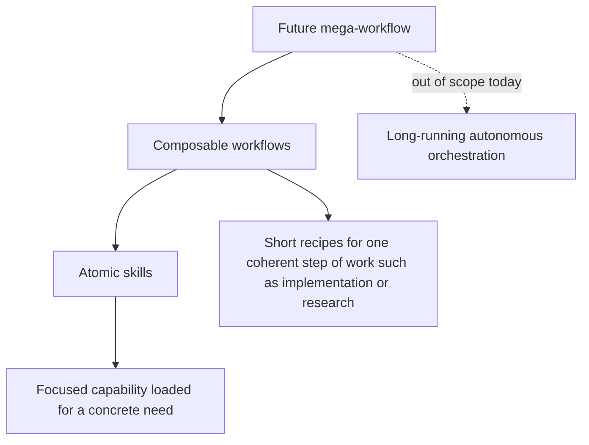

# myai

This repo is a personal opinionated skill set for coding agents. Helps to make AI agents more senior and trustable.

## What This Is

`myai` is a toolbox for agent-assisted software work:

- Atomic skills for specific tasks like research, skills writing, creating UI mockups and so on.
- Composable workflows that connect multiple skills for larger tasks, eg planning, implementation, and review.
- Philosophy docs that define the rules and core ideas behind the skills and workflows.

Those skills are distilled from personal experience in software development, problem solving and AI orchestration. This helps to reduce baby-sitting and make agents solutions aligned with the author's preferences.

> NOTE! This repo contains opinionated rules. You might find them useful or not aligned with your preferences. Cherry pick and modify if needed.

## Why Use It

By default AI agents approach given tasks and problems within generic patterns they were trained on. This requires lot's of time spent on planning, orchestrating and manual human reviews.

```text
human intent
  -> skill reading
  -> workflow learning and selection
  -> implementation / research / review
  -> evidence-backed completion
```

Examples of reusable habits that this repo helps to establish:

- Design before implementing when requirements are unclear.
- Debug from symptoms to root cause, not from guess to patch.
- Prefer trustworthy tests and runtime checks over fake coverage.
- Review for bugs, regressions, missing evidence, and maintainability during implementation.
- Keep scope bounded and delegate blockers to separate agents.
- Never claim something is fixed, complete, passing, or release-ready without
  fresh double checks.

## Installation

**Recommended:**

See [Catalog](#catalog) below to cherry pick needed skill sets.

**Manual selection:**

```bash
npx -y skills add quick-brown-foxxx/myai
```

**Force install or update all skills non-interactively:**

```bash
npx -y skills add quick-brown-foxxx/myai \
  # global
  -g \
  # all skills
  -s "*" \
  # list agents you need
  -a claude-code universal kilo codex opencode \
  -y
```

## Useful files for humans

Those files help to understand philosophies behind this repo and author's approaches to engineering and AI orchestration.

- `skills/README.md` - canonical skill catalog, workflow map, tag policy, and
  compatibility notes.
- `SKILLS-PHILOSOPHY.md` - how skills, workflows, agent roles, and orchestration
  layers fit together.
- `ENGINEERING-PHILOSOPHY.md` - coding, architecture, testing, tooling, and
  project setup principles.

## Catalog

The repository separates reusable guidance into three layers:



| Layer | Purpose |
| --- | --- | --- |
| Mega-workflow | Long-running multi-epic autonomy, not yet ready |
| Composable workflows | Explicit recipes made from several skills |
| Atomic skills | Focused reusable capabilities | Simple task-specific instructions |

The important boundary: current skills and workflows do not silently advance a
session. A human, team lead agent, or orchestrator decides the next phase.

TODO list all skill sets here

### Planning

TODO short description

To install:

```bash
npx -y skills add quick-brown-foxxx/myai \
  -s 'idea-sharpening' \
  # ... TODO
```

## Workflow Recipes

Workflows are short maps, not mandatory rituals.

```text
Planning:
  idea-sharpening -> brainstorming -> planning-implementation

Testing:
  high-level-testing-strategy -> architecting-test-infra
  -> test-driven-development / manual-testing
  -> verification-before-completion

Implementation verification-fixing:
  incremental-implementation -> verify -> fix -> verify -> complete

Debugging:
  systematic-debugging -> bug-root-cause-tracing -> fix at source
  -> regression proof -> optional layered protection

Review:
  doing-code-review -> receiving-code-review -> focused fixes
  -> verification-before-completion

Parallel work:
  when-and-how-to-run-parallel-agents -> delegated slices
  -> integration review -> integrated verification
```

Each workflow exits when evidence is good enough for the claim being made.

## Philosophy

The skill philosophy is about process discipline:

- Skills are reusable capability modules, not one-off prompt tricks.
- Workflows compose skills explicitly and stay under human or orchestrator
  control.
- Ceremony scales with task size, ambiguity, risk, and delegation.
- Subagents get bounded jobs; the lead integrates evidence and trade-offs.
- Completion claims require fresh evidence.

The engineering philosophy is about software substance:

- Build pits of success with types, validation, linters, CI, and clear structure.
- Prefer explicitness over guesswork and cleverness.
- Validate external boundaries early.
- Treat expected errors as values and programming errors as bugs.
- Prefer real integration and runtime evidence over mocked confidence.
- Separate code by responsibility and change axis.
- Use one strict tool per job.

## License

[MIT](LICENSE)
