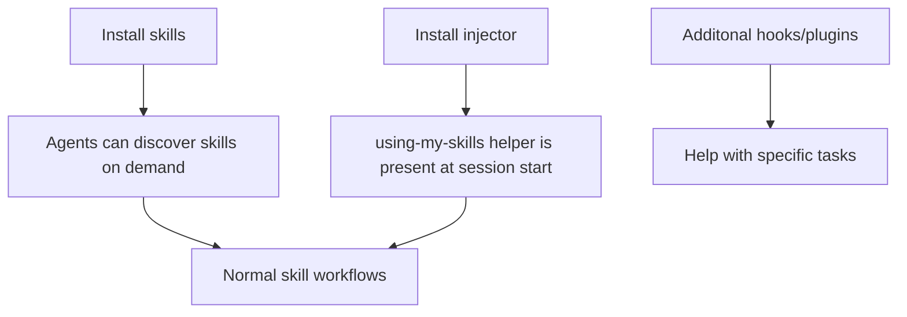
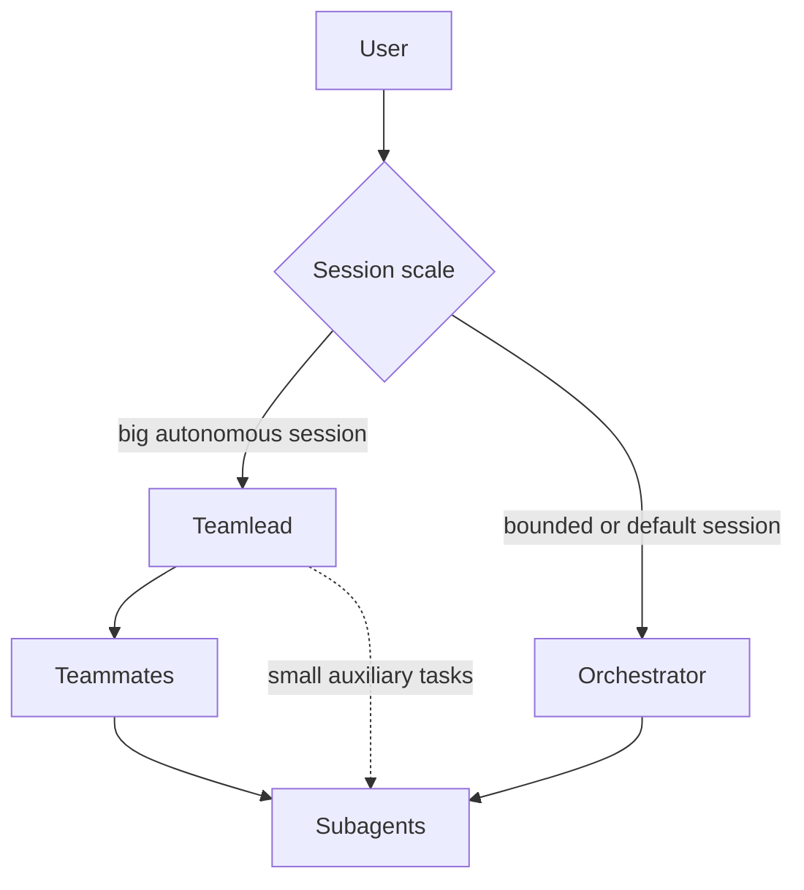
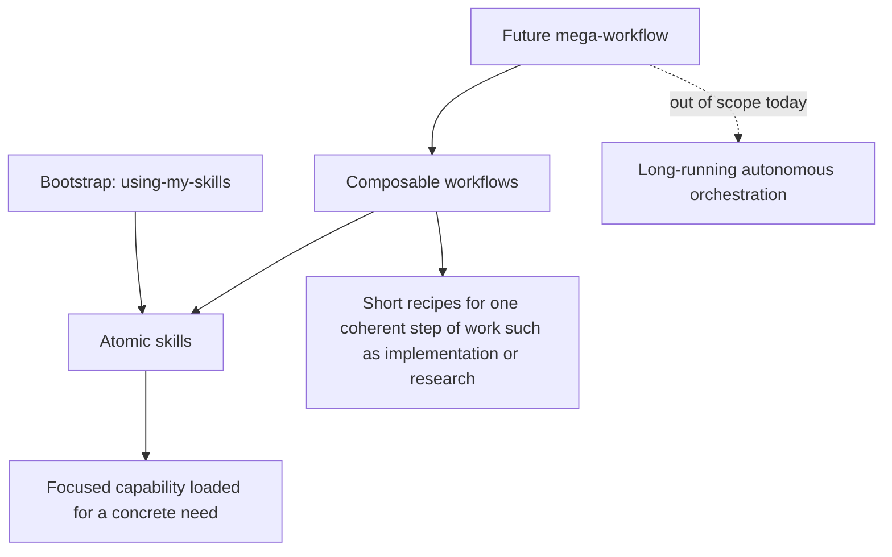
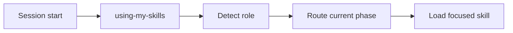

# myai

This repo is a personal, opinionated skill and settings set for coding agents. It helps make AI agents more senior and trustworthy.

It was created as a custom alternative to [Superpowers](https://github.com/obra/superpowers) and [addyosmani's agent skills](https://github.com/addyosmani/agent-skills).

## What This Is

`myai` is a toolbox for agent-assisted software work:

- Atomic skills for specific tasks like research, skills writing, creating UI mockups and so on.
- Composable workflows that connect multiple skills for larger tasks, eg planning, implementation, and review.
- Philosophy docs that define the rules and core ideas behind the skills and workflows.

Those skills are distilled from personal experience in software development, problem solving and AI orchestration. This helps reduce babysitting and align agent solutions with the author's preferences.

> NOTE! This repo contains opinionated coding rules. Senior engineers may disagree with some of them. For other users, especially non-engineers, this repo is a good default and can be used as-is. Anyway, cherry pick and modify if needed.

## Why Use It

By default, AI agents approach tasks and problems through generic patterns they were trained on. This forces humans to spend lots of time on planning, orchestration, and manual review.

This repo helps reduce that overhead by providing agents with guidance and verified patterns.

Examples of reusable habits in this repo:

- Design before implementing when requirements are unclear.
- Debug from symptoms to root cause, not from guess to patch.
- Prefer trustworthy tests and runtime checks over fake coverage.
- Review for bugs, regressions, missing evidence, and maintainability during implementation.
- Keep scope bounded and delegate only through explicit role boundaries.
- Never claim something is fixed, complete, passing, or release-ready without
  fresh double checks.

## Installation

There are multiple installation layers:



### Recommended Skills Installation Method

See [Catalog](#catalog) below to cherry pick needed skill sets.

### Manual Skills Selection

```bash
npx -y skills add quick-brown-foxxx/myai
```

### Force Install Or Update All Skills Non-Interactively

```bash
npx -y skills add quick-brown-foxxx/myai \
  --global \
  --skill "*" \
  --agent claude-code universal kilo codex opencode \
  -y
```

### Additional Hooks

**myai skills guide injector:**

This helps AI agents to better understand available workflows and roles.

> NOTE! This guide skill expects all skills from this repo to be installed.
> Edit `using-my-skills` skill to adjust to your installed skills.

**gpt5-style helper:**

Injects a style guide into system prompt and repeats it from time to time.
Is needed because gpt-5* models family have very poor
default text/documentation writing style.

#### Claude Code

TODO

#### Opencode

This repo has OpenCode agents settings in:

```text
.opencode/opencode.json
.opencode/agents/orchestrator.md
.opencode/agents/teamlead.md
.opencode/agents/teammate.md
```

Add this to `opencode.json`:

```jsonc
{
  "$schema": "https://opencode.ai/config.json",
  "plugin": [
    [
      "myai@git+https://github.com/quick-brown-foxxx/myai.git",
      {
        "usingMySkills": { "enabled": true }, // myai skills guide auto injection
        "gpt5StyleHelper": { "enabled": true } // writing style for gpt-5*
      }
    ]
  ]
}
```

Restart OpenCode after changing plugin config.

#### Other Tools

Install the `using-my-skills` skill manually. Note that this is less
reliable than the auto-injection.

```bash
npx -y skills add quick-brown-foxxx/myai \
  -s 'using-my-skills'
```

> No alternative installation methods for `gpt5-style helper` now.

Restart OpenCode after changing plugin files or config.

## Useful files for humans

Those files help to understand philosophies behind this repo and author's approaches to engineering and AI orchestration.

- `skills/README.md` - skill catalog, workflow map, tag policy, and
  compatibility notes.
- `SKILLS-PHILOSOPHY.md` - how skills, workflows, agent roles, and orchestration
  layers fit together.
- `ENGINEERING-PHILOSOPHY.md` - coding, architecture, testing, tooling, and
  project setup principles.

## Workflows

Workflows are short maps, not mandatory rituals.

```text
Planning:
  idea-sharpening -> brainstorming -> planning-implementation

Testing:
  high-level-testing-strategy -> architecting-test-infra
  -> test-driven-development / manual-testing
  -> verification-before-completion

Implementation verification-fixing:
  incremental-implementation -> verify -> fix -> verify -> complete

Debugging:
  systematic-debugging -> bug-root-cause-tracing -> fix at source
  -> regression proof -> optional layered protection

Review:
  doing-code-review -> receiving-code-review -> focused fixes
  -> verification-before-completion

Parallel work:
  when-and-how-to-run-parallel-agents -> delegated slices
  -> integration review -> integrated verification
```

Each workflow exits when evidence is good enough for the claim being made.

## Agent Hierarchy

Two session shapes and hierarchies are supported:



Role boundaries:

- `Teamlead` owns big goals, sequencing, delegation, trade-offs, integration, and phase transitions.
- `Orchestrator` owns one medium task or a bounded set of tasks and talks directly to the user.
- `Teammate` owns one coherent workflow, subsystem, or implementation slice inside a larger team.
- `Subagent` owns one bounded task, does not spawn children, and reports evidence, blockers, changes, risks, and next options.
- If the role is unclear, agent assumes `Orchestrator`.

## Philosophy

The skill philosophy is about process discipline:

- Skills are reusable capability modules, not one-off prompt tricks.
- Workflows compose skills explicitly and stay under role-aware control.
- Ceremony scales with task size, ambiguity, risk, and delegation.
- Big autonomous sessions use `Teamlead -> Teammates -> Subagents`; smaller sessions use
  `Orchestrator -> Subagents`.
- Subagents get bounded jobs; the Teamlead, Orchestrator, or Teammate integrates evidence and trade-offs.
- Completion claims require fresh evidence.

The engineering philosophy is about software substance:

- Build pits of success with types, validation, linters, CI, and clear structure.
- Prefer explicitness over guesswork and cleverness.
- Validate external boundaries early.
- Treat expected errors as values and programming errors as bugs.
- Prefer real integration and runtime evidence over mocked confidence.
- Separate code by responsibility and change axis.
- Use one strict tool per job.

## Catalog

The repository separates reusable guidance into three skill/workflow layers, with
one bootstrap layer that teaches agents how to enter them:



| Layer | Purpose | Current status |
| --- | --- | --- |
| Bootstrap | Role detection and workflow routing | `using-my-skills` plus Claude/OpenCode injectors |
| Mega-workflow | Long-running multi-epic autonomy | Not yet ready |
| Composable workflows | Explicit recipes made from several skills | Documented below |
| Atomic skills | Focused task-specific capabilities | Implemented as `skills/*/SKILL.md` |

The important boundary: current skills and workflows do not silently advance a
session. A human, Teamlead, or Orchestrator decides the next phase.

The full canonical map lives in `skills/README.md`. This root catalog is the
install-oriented summary for quickly choosing a skill set.

### Bootstrap

Agent will load this at the beginning of the session to understand this skill set and available workflows.



| Skill | Primary role | Notes |
| --- | --- | --- |
| `using-my-skills` | Bootstrap role detection and workflow routing | Auto-injected by Claude/OpenCode adapters when installed as a plugin |

Should be auto injected via Claude Code/OpenCode plugin

### Planning And Design

Use when the goal is vague, large, visual, or needs design before implementation.

| Skill | Primary role | Notes |
| --- | --- | --- |
| `idea-sharpening` | Refine vague ideas into sharper concepts | - |
| `brainstorming` | Turn understood features into technical specs | - |
| `planning-implementation` | Break specs into ordered, verifiable tasks | - |
| `architecting-changes` | Decide boundaries, ownership, and routing | May look opinionated! |
| `visual-mockups` | Explore UI layouts and diagrams visually with the human | - |
| `documentation-and-adrs` | Preserve durable decisions and agent-facing context | - |

To install:

```bash
npx -y skills add quick-brown-foxxx/myai \
  -s 'idea-sharpening' \
  -s 'brainstorming' \
  -s 'planning-implementation' \
  -s 'architecting-changes' \
  -s 'visual-mockups' \
  -s 'documentation-and-adrs'
```

### Implementation And Verification

Use after a plan exists or when a bounded implementation slice is ready.

| Skill | Primary role |
| --- | --- |
| `incremental-implementation` | Execute thin verified slices |
| `verification-before-completion` | Require evidence before success claims |
| `git-workflow` | Manage branches, worktrees, staging, commits, and handoff |

To install:

```bash
npx -y skills add quick-brown-foxxx/myai \
  -s 'incremental-implementation' \
  -s 'verification-before-completion' \
  -s 'git-workflow'
```

### Agent Orchestration

Use when a task or plan contains independent work that might be delegated safely.

| Skill | Primary role |
| --- | --- |
| `when-and-how-to-run-parallel-agents` | Decide whether work can be parallelized safely |
| `executing-plans-with-subagents` | Execute written plans through bounded subagent slices |

To install:

```bash
npx -y skills add quick-brown-foxxx/myai \
  -s 'when-and-how-to-run-parallel-agents' \
  -s 'executing-plans-with-subagents'
```

### Reusable Workflow Helpers

Use these at any stage when a specific risk or uncertainty appears.

These helpers are **very** useful when agents are losing focus or need to steer back to the task.

| Skill | Primary role |
| --- | --- |
| `prototype-first` | Validate risky assumptions before full implementation |
| `doubt-early` | Challenge uncertain plans or decisions with fresh context |

To install:

```bash
npx -y skills add quick-brown-foxxx/myai \
  -s 'prototype-first' \
  -s 'doubt-early'
```

### Testing

Use when deciding what behavior needs proof and how to verify it credibly.

> Note! All testing skills are opinionated!

| Skill | Primary role |
| --- | --- |
| `high-level-testing-strategy` | Decide what behavior needs proof |
| `architecting-test-infra` | Design scalable test fixtures and environments |
| `test-driven-development` | Implement selected automated behavior tests test-first |
| `manual-testing` | Verify real runtime behavior through browser, API, CLI, or infra |

To install:

```bash
npx -y skills add quick-brown-foxxx/myai \
  -s 'high-level-testing-strategy' \
  -s 'architecting-test-infra' \
  -s 'test-driven-development' \
  -s 'manual-testing'
```

### Debugging And Bug Prevention

Use for unexpected behavior, failing tests, CI failures, flaky behavior, and
runtime bugs.

| Skill | Primary role |
| --- | --- |
| `systematic-debugging` | Reproduce, localize, hypothesize, fix, and verify failures |
| `bug-root-cause-tracing` | Trace backward through call chains to the original trigger |
| `bug-protection-multi-layered` | Add layered defenses against recurring bug classes |

To install:

```bash
npx -y skills add quick-brown-foxxx/myai \
  -s 'systematic-debugging' \
  -s 'bug-root-cause-tracing' \
  -s 'bug-protection-multi-layered'
```

### Review And Feedback

Use for PRs, diffs, agent-written code, and review comments.

| Skill | Primary role |
| --- | --- |
| `doing-code-review` | Review diffs, PRs, branches, and agent-written code |
| `receiving-code-review` | Classify and handle review feedback rigorously |

To install:

```bash
npx -y skills add quick-brown-foxxx/myai \
  -s 'doing-code-review' \
  -s 'receiving-code-review'
```

### Domain-Specific Skills

Use these during larger workflows when the task crosses a domain boundary.

| Skill | Primary role |
| --- | --- |
| `api-design` | Design stable APIs, protocols, and programmable boundaries |
| `security-and-hardening` | Harden user input, auth, secrets, files, sessions, and integrations |
| `performance-optimization` | Measure, identify, fix, and verify performance bottlenecks |
| `code-simplification` | Refactor for clarity without behavior changes |
| `ci-cd-and-automation` | Configure CI/CD, quality gates, and deployment automation |
| `release-automation-small-repos` | Build small release/publishing automation repositories |
| `shipping-and-launch` | Prepare launches, rollouts, monitoring, and rollback |

To install:

```bash
npx -y skills add quick-brown-foxxx/myai \
  -s 'api-design' \
  -s 'security-and-hardening' \
  -s 'performance-optimization' \
  -s 'code-simplification' \
  -s 'ci-cd-and-automation' \
  -s 'release-automation-small-repos' \
  -s 'shipping-and-launch'
```

### Atomic And Task-Specific Skills

Use these for focused support tasks that can appear inside larger workflows.

| Skill | Primary role | Notes |
| --- | --- | --- |
| `how-to-write-skills` | Create or refine portable, discoverable skills | Opinionated! |
| `manual-interacting-with-claude-code-via-cli` | Verify Claude Code CLI behavior with real `claude` commands | - |
| `manual-interacting-with-codex-via-cli` | Verify Codex CLI behavior with real `codex` commands | - |
| `manual-interacting-with-opencode-via-cli` | Verify OpenCode CLI behavior with real `opencode` commands | - |
| `upstream-source-research` | Research upstream source code, issues, releases, and history | - |
| `ai-edge-research` | Research upstream adoption and AI tooling signals in communities | - |
| `writing-upstream-bug-reports` | Prepare evidence-backed upstream bug reports for maintainers | - |

To install:

```bash
npx -y skills add quick-brown-foxxx/myai \
  -s 'how-to-write-skills' \
  -s 'manual-interacting-with-claude-code-via-cli' \
  -s 'manual-interacting-with-codex-via-cli' \
  -s 'manual-interacting-with-opencode-via-cli' \
  -s 'upstream-source-research' \
  -s 'ai-edge-research' \
  -s 'writing-upstream-bug-reports'
```

## License

[MIT](LICENSE)
