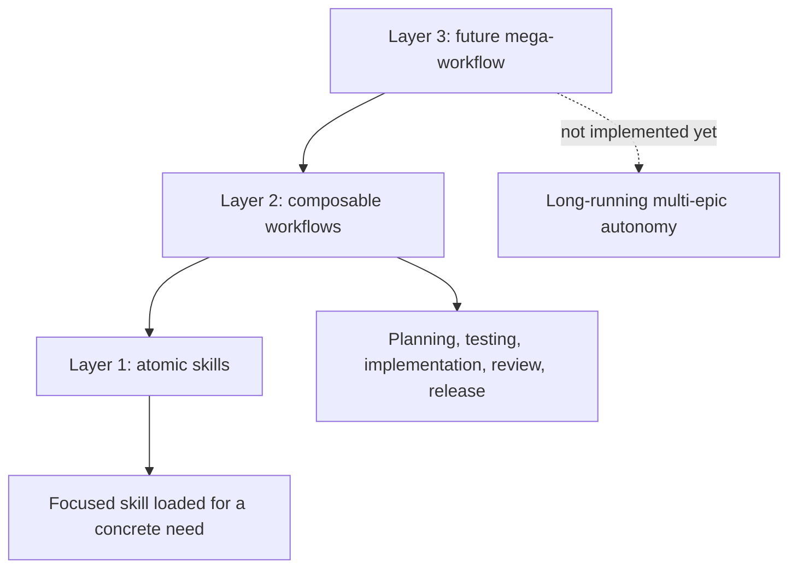

# Skills Philosophy

This document explains how this repository thinks about skills, workflows, agent
roles, and orchestration. It complements `ENGINEERING-PHILOSOPHY.md` instead of
duplicating it.

`ENGINEERING-PHILOSOPHY.md` governs engineering substance: code quality,
architecture, testing values, typing, explicitness, tooling, and project setup.

`SKILLS-PHILOSOPHY.md` governs agent-process structure: how skills are packaged,
discovered, invoked, composed, delegated, and bounded.

## Core Thesis

Skills are are reusable capability modules that can be composed into explicit workflows.



The higher the layer, the more explicit the orchestration must be.

## Layer 1: Atomic Skills

Atomic skills are self-contained capabilities loaded for a specific task,
domain, decision, or discipline.

Examples:

- `upstream-source-research` for inspecting upstream packages and repositories.
- `ai-edge-research` for research of AI tools popular among practitioners.
- `how-to-write-skills` for authoring or refining skills.
- `code-simplification` for behavior-preserving clarity refactors.

Atomic does not mean tiny. It means the skill has one coherent responsibility and
clear trigger conditions.

## Layer 2: Composable Workflows

Composable workflows are short, explicit recipes that sequence several skills for
one coherent unit of work.

Examples:

```text
Planning:
  idea-sharpening -> brainstorming -> planning-implementation

Testing:
  high-level-testing-strategy -> architecting-test-infra
  -> test-driven-development / manual-testing
  -> verification-before-completion

Implementation-verification-fixing loop:
  incremental-implementation -> verify -> review -> fix -> restart
```

These workflows are session-level compositions. They may be used alone or nested
inside a larger session, but they should not silently advance themselves.

## Layer 3: Future Mega-Workflow

The future `mega-workflow` is for long-running autonomous work across multiple
features, epics, production feedback loops, and teammate/teamlead hierarchies.

That layer is intentionally out of scope right now.

For now, document it as a boundary:

```text
mega-workflow
  owns long-term autonomous orchestration
  uses middle-layer workflows internally
  delegates to teammate agents
  stays outside current skill implementation
```

Do not turn current skills into a premature mega-workflow.

## Right-Sized Ceremony

Ceremony scales with task size, ambiguity, risk, and delegation.

```text
Tiny clear task
  -> use the needed atomic skill, very simple workflow

Small known-code task
  -> quick inline plan, implement, verify

Moderate multi-file task
  -> use a normal workflow with checkpoints and intermediate docs

Large ambiguous task
  -> design, than plan, than delegate, than review, than verify with fresh context
```

The goal is not ritual. The goal is to preserve correctness, context, and human
control at the lowest useful cost.

## Agent Roles

Use roles to preserve context boundaries.

```text
Human or ai team lead agent
  owns goals, sequencing, trade-offs, and integration

Teammate agent/orchestrator
  owns a larger isolated workflow step or subsystem

Subagent
  owns one bounded research, review, verification, or implementation task
```

Subagents can not spawn their own children and should not silently expand scope.
Teammates may use subagents inside their assigned step. The lead integrates and
decides the next phase.

## Verification Invariant

Every workflow inherits the same invariant:

```text
No completion, correctness, fixed, passing, release-ready, or reviewed claim
without fresh evidence appropriate to that claim.
```

Evidence can be automated tests, builds, lint/type checks, manual checks, browser
verification, source citations, inspected diffs, CI logs, or release artifacts.
The type of evidence depends on the claim.

## Glossary

**Skill**: A self-contained capability module (file) loaded for a concrete task,
domain, decision, or discipline.

**Atomic skill**: A skill with one coherent responsibility and clear trigger
conditions.

**Workflow**: An explicit sequence or loop that composes several skills for one
coherent unit of work.

**Mega-workflow**: Future long-term autonomous orchestration across multiple
epics and workflows. Out of scope for current skill implementation.

**Team lead**: The human or agent controlling high level sequencing, delegation,
integration, and phase transitions.

**Teammate agent** or **Orchestrator**: An agent responsible for a larger isolated workflow step or
subsystem.

**Subagent**: A bounded one-shot agent for a small research, implementation,
review, or verification task.

**Checkpoint**: An intentional pause to inspect evidence, reconcile issues, and
decide whether to continue.

**Verification-fixing loop**: A repeated cycle of verification, triage, fixing,
and re-verification until the result converges or the approach is escalated.

**Fresh-context verification**: Independent verification by a new agent/session
after the main implementation loop.
