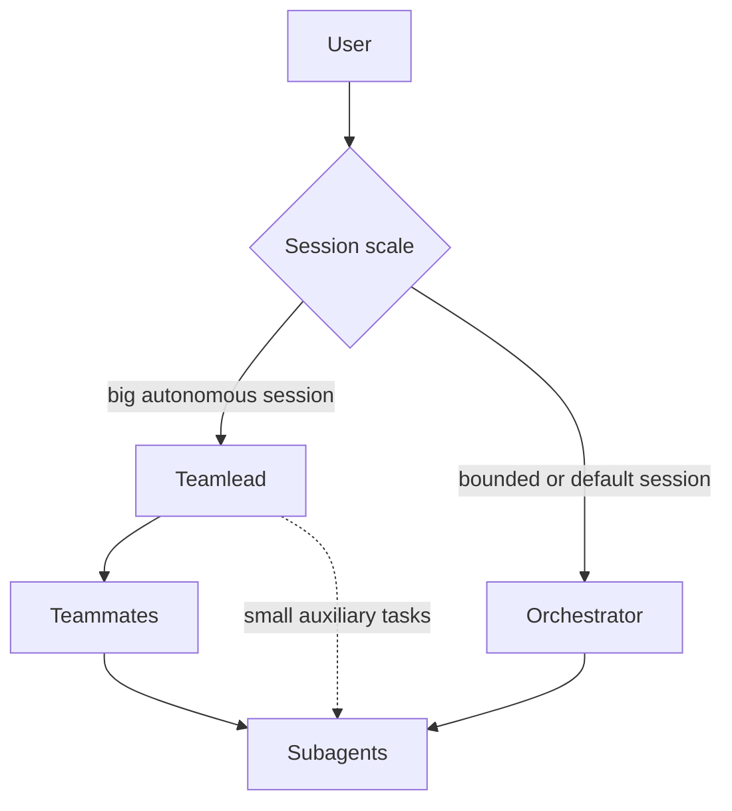

# Personal Workflow Draft

This is a draft for the future high-level autonomous workflow layer. It is not
the current skill map. The current skill catalog and short composable workflows
live in `../skills/README.md`.

The future long-running workflow described here is the `mega-workflow` layer in
`../SKILLS-PHILOSOPHY.md`.

---

## Current Agent Hierarchy

Users choose the session shape.



`Teamlead` owns goals, sequencing, delegation, trade-offs, integration, and
phase transitions for big multi-step work.

`Orchestrator` owns one medium task, one question, or a bounded set of tasks.
There are no Teammates when an Orchestrator is active.

`Teammate` owns one coherent workflow, subsystem, or implementation slice inside
a Teamlead-led session.

`Subagent` owns one bounded task. It cannot spawn children and must not decide
higher-level phase transitions.

If the current role is unclear, assume `Orchestrator`.

## Context Isolation

The hierarchy exists to protect context boundaries.

`Teamlead` keeps the big-picture context: goals, phases, assignments,
integration, trade-offs, and user communication.

`Teammate` keeps the medium-scope context for a coherent slice. It may plan
inside that slice, use bounded subagents, integrate their reports, and verify the
assigned outcome.

`Subagent` keeps noisy low-level context: searches, one implementation edit,
one review pass, one verification run, one research question, or one focused
debugging thread. It reports evidence, blockers, changed files or sources
inspected, risks, and next options.

## Workflow Shape

The future `mega-workflow` should coordinate explicit phase transitions:

```text
design -> implementation planning -> execution -> verification/fixing
  -> fresh-context re-verification -> finish
```

Each phase can use current skills and short workflow recipes, but those skills
do not silently advance the higher-level process.

Design produces high-level specs or decisions. Small tasks may only need a short
prompt; big tasks may need brainstorming, prototypes, research, and review.

Implementation planning produces low-level tasks, dependencies, acceptance
criteria, verification steps, and delegation boundaries.

Execution changes files in bounded slices. For big work, a Teamlead may assign
coherent slices to Teammates, and Teammates may delegate bounded subagent tasks.

Verification/fixing loops through review, automated checks, manual checks,
triage, fixes, and re-verification until evidence is good enough or the approach
must return to design or planning.

Fresh-context re-verification uses a new agent or session to review the finished
result without the implementation context. The Teamlead or human triages any
findings and decides whether to re-enter verification/fixing.

## Control Rule

The `mega-workflow` should be started by explicit human, Teamlead, or
Orchestrator prompting or commands. It should not be triggered accidentally by a
normal skill invocation.

Individual skills should stay aligned with this model, but they remain atomic
capabilities or short composable workflows. They do not own high-level phase
transitions.

---

And I have a special personal workflow now.

It is sort of composing all sub skills and sub steps of existing workflow from superpowers and creates a more high level workflow.

One important idea of the workflow is two or three level hierarchy of the work. Main level is main high level team lead of the process. Usually it's either me, the human, or the high level AI. Second level is a team leads teammates - smaller orchestration agents. And the third level is sub agent. Subagent is a small agent with dedicated task that can't have any children, and it just writes a small modification or runs a research or test and so on. Main team lead can also spawn sub agents to do small checks when giving this work to a teammate will be too much. For example implementing a big feature on front end can be sent to a teammate, but doing documentation research can be delegated only to a small sub agent.

The idea is context management and context isolation. Subagent contains within itself low level context of small operations, running particular bash comments, navigating the website and so on. Teammate contains context of a bigger multi-step task. That may have multiple sub steps. Each sub step delegated to subagents and also a team lead can run some small verification or actions itself. It can ping if a backend is up or start tests, but teammate or team lead should not eG fix tests or research why the backend not starts. And the team lead contains the context of a very big feature or epic that is split into multiple separate teammates and the team lead only operates teammates and it not cares about low level stuff.

Team lead controls entire workflow. Teammates are responsible for isolated steps of workflow. Subagents are used by teammates during their work, or by teamlead for auxilary small actions.

So, the workflow.

Workflow is all about one coherent piece of work. Eg only backend or only front end. Or backend with front end when feature is not very big. It should not cover entire complex epic containing multiple complex steps. So e G if we want to bootstrap up an application, create tests for it and deploy the application to staging - This is several separate workflows. Each one after another, or unrelated workflows can run in parallel.

Each step may be run by own teammate if the work is very big or all by one teammate for small work.

- Workflow starts of first big step of "task  design". usually this is between me and teammate or in some cases between teamlead and teammate. The final artifact of this is one/several design specs - high level.
  - Task design may be just a short prompt if a task is small;
  - couple of messages in a chat if task is medium
  - or big multi-step brainstorming with prototyping, resarches and so on - is if task is very big.

Then next big step. Implementation planning.
- First create a low level plan covering each subsystem/file/directory and modifications based on the design from the previous step
  - Creating a plan may include running several subagents,
  - and includes designing test cases
  - checking documentation if needed
  - maybe even running prototypes
  - researching the code, and so on.

Next step - implementation. Teammate runs implementator agents for smaller subtasks. This is relatively strightforward. It's relatively small and simple and if the task is not super big can be merged with the next one step.

Once the core task is done, teammate proceeds to "verification-fixing loop".
- In this process, the teammate spawns several children that do complex code review, manual or automatic verification and so on.
- Then main agent triages their findings and spawns agents to fix.
- After this it returns back to verification and so on until the result is good.
Sometimes it can step back to redesigning or replanning or rewriting something if verification will fail or big problems will be found.
Anyway, eventually verification fixing loop is done.

So usually 25% go to initial "task design" and "implementation" takes 25% and ~50% go to "verification-fixing loop", and after this comes next very big step that may be as long as all previous ones together in worst cases. or may be fast if work is small.

After this teammate usually finishes and exits , but after this I respawn new trammate from scratch, I give it initial docs and specs froom design and ask it to restart verification from scratch with fresh context and at high level.
Then I triage found issues and ask agent to enter same "verification-fixing loop".
After this I close verification agent and start new one with exactly same process. So I enter again high level verification fixing loop, but with fresh agent context each time until satisfy I will be satisfied with quality and new found issues will be minor.

I want to say that all this workflow is very high level. It should not be driven by accidental skill invocation because skills are invoked progressively/nondeterministic, and I don't want agent occasionally to invoke the step when it really should not come.

Instead I want this process to be controlled by explicit prompting or commands (like skills but they can't be auto read by agents, they can be only started by human/teamlead). So it stays controlled.

Teammate receives description of its high level step that it should proceed now and implement entire step. Once agent finishes the step, I may invoke the next command for the same teammate or may exit it and start a new agent with next command.

So the workflow should be reflected in the skills, but individual skills do not drive the high-level phase changes. They should be aligned with it. Short workflows can compose skills for one coherent unit of work, while this future mega-workflow remains the upper orchestration layer.

---

See [../.tmp/addy-agent-skills/agents/README.md](../.tmp/addy-agent-skills/agents/README.md) - it's not my pattern but I like structure
