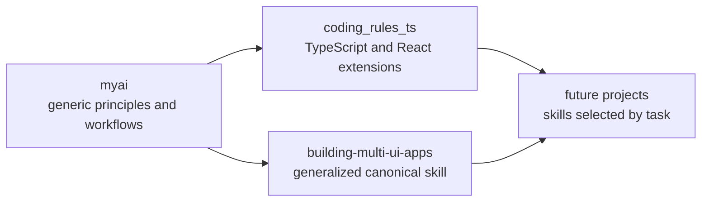
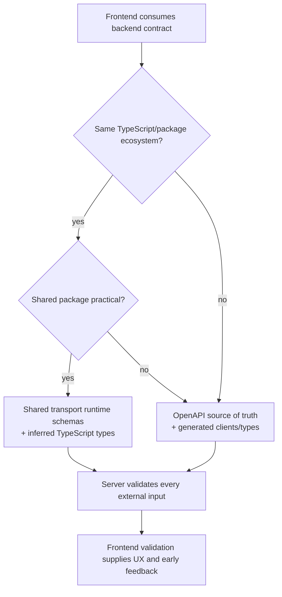
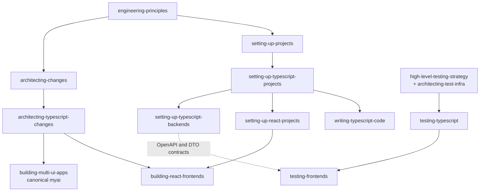

# TypeScript/JavaScript Skill Set Roadmap and Decision Ledger

> **Document status:** Approved scope, inventory, and sequencing; each technical choice is governed by its explicit decision status below
>
> **Date:** 2026-07-21
>
> **Target auxiliary repository:** future `coding_rules_ts`
>
> **Scope:** durable direction, ownership, sequencing, and decision status—not detailed skill specifications

## Purpose

This document records the approved direction for a TypeScript/JavaScript and React skill set. It is the planning boundary for later work in which each skill will be researched, designed, reviewed, and verified independently.



The roadmap intentionally keeps descriptions high-level. Package selections, framework profiles, examples, and strict rules belong in the future design of each skill—not in this ledger.

## Goals

- Create a coherent, task-shaped TS/JS skill set that extends canonical `myai` workflows.
- Cover project setup, architecture, coding, backend setup, React implementation, and testing without duplicating generic theory.
- Preserve adjustable defaults for different runtimes, deployment targets, frontend kinds, and project scales.
- Implement and verify skills one at a time so later skills can learn from earlier evidence.

## Non-goals and Deferred Scope

| Item | Status | Boundary |
| --- | --- | --- |
| Templates or shared code packages | **Deferred** | Skills provide guidance initially; reusable artifacts may be reconsidered after repeated needs are demonstrated. |
| Dedicated async rules skill | **Rejected** | Modern AI models write good async ts/js code by default |
| Separate runtime/module skill | **Deferred** | Runtime and module-system decisions belong in project setup. |
| Package/library authoring | **Out of current scope** | The initial skill set targets applications and services. |
| SvelteKit as a default | **Proposed—not accepted** | Right now focus on React and framework-less frontend aspects. Maybe add SvelteKit later. |
| Complex `coding_rules_ts` repository layout | **Deferred** | Start with skills only; add supporting structure only when evidence justifies it. |
| Locked framework or package versions | **Out of scope** | Future skills should use current stable documentation and project constraints. |
| Exhaustive package lists | **Out of scope here** | Future skills may recommend small, role-based sets after research. |

## Decision Status Vocabulary

```text
ACCEPTED  -> governs future implementation unless deliberately superseded
PROPOSED  -> preferred direction, awaiting validation during skill design
OPEN      -> unresolved; preserve alternatives and gather evidence
DEFERRED  -> intentionally outside the initial implementation scope
REJECTED  -> explicitly excluded
```

## Accepted Decisions

### Repository and Ownership Boundaries

| Decision | Status | Consequence |
| --- | --- | --- |
| Generic engineering principles and workflows remain in canonical `myai`. | **Accepted** | TS skills reference and extend `myai`; they do not restate its general architecture, testing, setup, or verification theory. |
| TS/JS and React ecosystem extensions initially live in future `coding_rules_ts`. | **Accepted** | The auxiliary repository begins as a focused skills collection. |
| `building-multi-ui-apps` moves from `coding_rules_python` to canonical `myai`. | **Accepted** | Generalize the skill, retain Python applicability, and add TS/JS examples rather than creating language-specific duplicates. |
| `setting-up-typescript-projects` remains the canonical planned name. | **Accepted** | The name is task-shaped, discoverable, and parallel to `setting-up-python-projects`; no alternate name is needed. |
| Avoid duplicate generic theory. | **Accepted** | Extensions should state ecosystem-specific deltas and route to their parent `myai` skills. |
| Reconcile contradictory canonical `myai` examples before relying on them as TS parents. | **Accepted** | Alignment must explicitly address current MSW and universal Zod language. Accepted TS extension decisions govern ecosystem-specific work after alignment; contradictory parent examples must not be left silently in place. |

### Testing and API Contracts

| Decision | Status | Consequence |
| --- | --- | --- |
| Do not use MSW. | **Accepted** | The local policy prioritizes real behavior over request interception; use normal executable mock/test HTTP servers. |
| Prefer realistic HTTP boundaries. | **Accepted** | Tests should exercise real sockets, serialization, routing, and generated contracts where practical. |
| Backends expose complete generated OpenAPI documents. | **Accepted** | In code-first approaches, endpoint annotations or metadata are generation inputs—not the finished contract. API bootstrap and architecture guidance must require a complete generated document. |
| OpenAPI supports test servers and client contract verification. | **Accepted** | Generated contracts should enable realistic mock/test servers and detect frontend/client drift. |
| Frontend/backend systems use the DTO selection strategy below. | **Accepted** | Accidental copying or coupling is not an acceptable default. Library, tooling, and profile mechanics remain open. |

## Accepted Decision: DTO and Runtime Contract Strategy

> **Status: Accepted.** This selection strategy governs future ecosystem-specific work. Exact schema libraries, generators, and profile mechanics remain open until validated during individual skill design.

### Recommended Selection Model



#### Same TypeScript/package ecosystem: schema-first transport contracts

When frontend and backend are in the same TypeScript/package ecosystem and sharing a package is practical, prefer:

```text
shared runtime transport schema
  ├─> inferred server DTO type
  ├─> inferred frontend DTO type
  └─> boundary validation
```

- Share runtime schemas for **transport DTOs only**, with TypeScript types inferred from those schemas.
- Keep the server authoritative. Browser code and browser-supplied data remain untrusted even when both sides consume the same package; the server validates every external request regardless of frontend validation.
- Treat frontend validation as usability and early feedback—not authorization, integrity enforcement, or security.
- Do not expose backend entities, persistence models, internal domain types, or use-case inputs merely because both sides use TypeScript.
- Keep exact **Zod vs. Valibot** selection open and profile-specific until the relevant skill is designed and validated.

Plain TypeScript types alone are insufficient because they are erased at runtime. They cannot prove that network JSON, storage data, environment values, or untrusted user input matches a compile-time declaration. A type assertion can silence the compiler without validating a single byte.

#### Separate repos or cross-language consumers: OpenAPI-first contracts

When consumers live in separate repositories, use different languages, or cannot practically consume a shared source package, prefer:

```text
authoritative complete OpenAPI document
  ├─> generated client
  ├─> generated TypeScript types
  ├─> executable mock/test server
  └─> optional generated/runtime validators where needed
```

Generated clients and types reduce manual drift while preserving a language-neutral boundary. Runtime validators may also be generated or derived when clients must validate responses defensively.

### Source-of-Truth Models

Choose **one** authoritative model per system; do not maintain OpenAPI annotations, shared schemas, and handwritten DTOs as three independent truths. Every accepted model and toolchain must generate, or provably align with, one complete OpenAPI document. In code-first models, endpoint metadata and annotations are inputs used to generate that document.

| Model | Best fit | Authoritative artifact | Derived artifacts |
| --- | --- | --- | --- |
| Shared runtime-schema-first | Same TypeScript/package ecosystem and practical shared package | Transport runtime schemas | Complete OpenAPI document with provable alignment, TS types, adapters, clients, and test-server inputs |
| Backend/code-first OpenAPI | Framework can generate a complete document from authoritative endpoint metadata | Backend endpoint DTO metadata/annotations as generation inputs | Complete OpenAPI document, generated clients/types, validators, and test-server inputs |
| OpenAPI-first | Separate repos, multiple languages, or contract-governed APIs | Complete OpenAPI document | Server/client stubs, types, validators, and mock/test servers |

The exact model is a project-profile decision. Completeness checks and drift detection are required whichever model is selected.

## Planned Skill Inventory

All entries below are **Planned**. Descriptions are intentionally rough boundaries, not final skill bodies or frontmatter.

| Order | Skill | Initial owner | Parent/foundation skills in `myai` | High-level responsibility |
| ---: | --- | --- | --- | --- |
| 1 | `setting-up-typescript-projects` | `coding_rules_ts` | `engineering-principles` → `setting-up-projects` | Adjustable TS/JS application bootstrap: package manager, strict compiler configuration, runtime/module decisions, runner/build choices, ESLint/rules, recommended package categories, and brief monorepo routing. |
| 2 | `writing-typescript-code` | `coding_rules_ts` | `engineering-principles` | Coding guidance for any TS application: strict type handling, TS/ESLint rules, reusable patterns, boundary validation, and case-based guidance. |
| 3 | `architecting-typescript-changes` | `coding_rules_ts` | `engineering-principles` → `architecting-changes` | TS-specific architecture router parallel to `architecting-python-changes`; routes project shape, backend, frontend, multi-interface, contract, and testing concerns. |
| 4 | `setting-up-react-projects` | `coding_rules_ts` | `setting-up-projects` → `setting-up-typescript-projects` | Bootstrap distinct React frontend kinds; compare Next.js, raw React + React Router, and other suitable frameworks; cover React-specific setup and package categories without forcing one profile onto all projects. |
| 5 | `setting-up-typescript-backends` | `coding_rules_ts` | `setting-up-projects` → `setting-up-backends` → `setting-up-typescript-projects` | Backend bootstrap and framework selection: NestJS default, Hono for edge profiles, Prisma, authentication, complete OpenAPI generation, contract strategy, and related setup boundaries. |
| 6 | `building-react-frontends` | `coding_rules_ts` | `architecting-changes` → `architecting-typescript-changes` | Architecture for new React subsystems plus low-level React implementation guidance, state categories and management, component boundaries, and patterns. |
| 7 | `testing-typescript` | `coding_rules_ts` | `high-level-testing-strategy` → `architecting-test-infra` → `test-driven-development` / `manual-testing` | TS/JS testing patterns, recommended tool categories, test-infrastructure architecture, real service boundaries, and routing to frontend-specific testing. |
| 8 | `testing-frontends` | `coding_rules_ts` | `high-level-testing-strategy` → `architecting-test-infra` → `testing-typescript` → `test-driven-development` / `manual-testing` | Framework-neutral frontend testing with React-specific sections and Svelte/other applicability: unit, component, realistic UI, executable HTTP test servers, Playwright, and testcontainers when warranted. Explicitly excludes MSW. |
| 9 | `building-multi-ui-apps` (generalize and move) | canonical `myai` | `engineering-principles` → `architecting-changes` | Multi-interface application architecture across CLI, GUI, API, automation, and other adapters; retain Python examples and add TS/JS examples. |

### Rough Dependency Map



This is an implementation and routing aid, not a mandatory runtime chain. Agents should load only the foundation and focused skills needed for the current task.

## Skill Boundaries

### Setup versus implementation

- `setting-up-typescript-projects` owns cross-project bootstrap decisions and strict baseline tooling.
- `setting-up-react-projects` owns React project profiles and framework bootstrap choices.
- `setting-up-typescript-backends` owns service/backend bootstrap profiles.
- `writing-typescript-code` owns language-level application coding guidance after setup.
- `building-react-frontends` owns subsystem architecture and React implementation after a project exists.

### General testing versus frontend testing

- `testing-typescript` owns TS/JS test conventions, infrastructure patterns, and backend/reusable-module/CLI applicability.
- `testing-frontends` owns browser and component proof, framework-neutral UI concerns, React-specific sections, Playwright, and realistic frontend/API integration.
- Generic questions such as what behavior deserves proof, whether infrastructure is warranted, and how to verify completion remain in canonical `myai` testing skills.

### Multi-interface applications

`building-multi-ui-apps` belongs in `myai` because reusable cores and thin interface adapters are language-independent architecture. Its generalized version should:

- preserve Python guidance rather than replacing it;
- add TS/JS examples as ecosystem illustrations;
- route to language-specific skills for implementation detail;
- avoid becoming a React-only or desktop-only architecture skill.

## Phased Roadmap

### Prerequisite — Align canonical `myai` parents

**Status: Planned and blocking**

Before TS extension skills treat canonical `myai` guidance as an authoritative parent, reconcile ecosystem-specific examples that conflict with this accepted roadmap:

1. Remove or qualify MSW recommendations so the accepted executable HTTP test-server policy is not contradicted.
2. Reframe universal Zod language so Zod vs. Valibot and other tooling mechanics remain profile-specific while runtime validation stays mandatory.
3. Inspect other parent examples for equivalent conflicts and record any deliberate exceptions.

Accepted TS extension decisions govern the ecosystem-specific work after this alignment. Parent guidance must be updated, qualified, or explicitly superseded; agents must not be left to resolve silent contradictions.

**Exit evidence:** relevant canonical examples and extension decisions form one coherent hierarchy, and a fresh-context review finds no unresolved contradiction in the three named areas.

### Phase 0 — Establish the auxiliary repository

**Status: Planned**

1. Create `coding_rules_ts` with a skills-only initial layout.
2. Record its dependency on canonical `myai` principles and workflows.
3. Define catalog and validation conventions without introducing templates or shared code packages.

**Exit evidence:** the repository can discover and validate one minimal skill without special layout machinery.

### Phase 1 — Build the language foundation

**Status: Planned**

1. Design `setting-up-typescript-projects`.
2. Design `writing-typescript-code` using setup profiles rather than duplicating setup instructions.
3. Design `architecting-typescript-changes` as the routing bridge from generic architecture to TS-specific concerns.

**Exit evidence:** fresh agents can bootstrap a representative TS application, apply strict language guidance, and route architecture questions without contradictory defaults.

### Phase 2 — Add project profiles

**Status: Planned**

1. Design `setting-up-react-projects` with a framework decision matrix.
2. Design `setting-up-typescript-backends` with NestJS as the default profile and Hono for edge profiles.
3. Validate complete OpenAPI generation/alignment and the tooling mechanics for the accepted DTO selection strategy.

**Exit evidence:** representative frontend and backend bootstraps run, build, typecheck, and expose their intended development/test boundaries.

### Phase 3 — Add implementation architecture

**Status: Planned**

1. Design `building-react-frontends` against multiple React project profiles.
2. Move and generalize `building-multi-ui-apps` into canonical `myai` while preserving Python applicability and adding TS/JS examples.
3. Confirm that generic architecture theory remains in `myai` and extensions contain only ecosystem-specific guidance.

**Exit evidence:** fresh agents can place state, transport, domain, UI, and adapter responsibilities consistently in realistic tasks.

### Phase 4 — Add trustworthy testing guidance

**Status: Planned**

1. Design `testing-typescript` and its routing to canonical `high-level-testing-strategy`, `architecting-test-infra`, `test-driven-development`, and `manual-testing` skills.
2. Design `testing-frontends` with executable HTTP test servers, realistic UI tests, Playwright, and conditional testcontainers.
3. Exercise complete generated OpenAPI documents in mock/test server and client-verification scenarios.

**Exit evidence:** representative tests prove real behavior without MSW and clearly distinguish unit, integration, component, and browser evidence.

### Phase 5 — Integrate and review the skill set

**Status: Planned**

1. Review triggers, overlap, parent-skill references, and workflow maps across the completed skills.
2. Test positive and negative discovery prompts so skills load neither too broadly nor too narrowly.
3. Revisit open decisions using accumulated project evidence; record accepted, rejected, or profile-specific outcomes.

**Exit evidence:** catalogs are consistent, realistic end-to-end prompts route correctly, and no skill duplicates generic `myai` theory.

## Verification Standard for Every Future Skill

Each skill must earn confidence independently before the next roadmap phase relies on it.

```text
draft skill
  -> repository validation
  -> fresh-context review
  -> realistic bootstrap/use prompts
  -> real commands and runtime evidence where relevant
  -> revise and repeat when findings are material
```

Minimum expectations:

| Check | Required evidence |
| --- | --- |
| Structure and discoverability | Valid skill layout/frontmatter; task-shaped description; positive and negative trigger prompts. |
| Fresh-context review | A reviewer without authoring context identifies ambiguity, duplication, missing routing, or over-prescription. |
| Executable setup | For setup skills, run actual install, lint, typecheck, test, build, and start/smoke commands appropriate to the selected profile. |
| Runtime/API behavior | For backend and contract guidance, prove the OpenAPI document is complete and aligned with endpoint behavior, then exercise a real server/client or executable test-server path. |
| UI behavior | For React/frontend skills, run browser or component scenarios and Playwright where the claim requires browser evidence. |
| Cross-skill coherence | Confirm parent skills exist, references are canonical, and generic guidance is not copied into the extension. |
| Completion claim | Use fresh evidence; document skipped checks and why. |

No specific command is prescribed in this roadmap because commands depend on the future package manager, runtime, framework, and project profile. The governing rule is that configuration snippets alone are not proof when executable behavior can be checked.

## Open Decisions and Questions

| Question | Status | Evidence needed |
| --- | --- | --- |
| Zod or Valibot as the preferred runtime schema tool? | **Open / profile-specific** | Ecosystem integration, OpenAPI generation quality, bundle/runtime cost, ergonomics, and maintenance signal. |
| Should SvelteKit later enter the setup decision matrix or become a default? | **Proposed—not accepted** | It is excluded from current roadmap implementation; future consideration requires explicit approval and current framework evidence. |
| Which package manager and runner/build defaults should each profile use? | **Open** | Current stable tooling, runtime targets, framework conventions, and real bootstrap evidence. |
| How should a schema-first shared package emit or align with a complete OpenAPI document? | **Open** | Tooling prototype proving completeness and drift detection without duplicate manual definitions. |
| When do frontend tests warrant testcontainers? | **Open / conditional** | Complexity, fidelity benefits, startup cost, and whether a normal executable HTTP server is sufficient. |
| When should templates or shared packages be reconsidered? | **Deferred** | Repeated, stable patterns across several verified skills and projects. |

## Risks

| Risk | Mitigation |
| --- | --- |
| Skills duplicate `myai` and drift from generic principles. | Keep explicit parent links and write only TS/React deltas; perform cross-skill fresh-context review. |
| Defaults become stale or version-bound. | Avoid locked versions in skills; consult current upstream documentation during each design and verification pass. |
| Framework guidance becomes a package catalog. | Recommend by responsibility and project profile; keep lists short and evidence-based. |
| Shared DTOs leak backend internals into the frontend. | Share transport schemas only; preserve separate domain and persistence models. |
| Compile-time types are mistaken for runtime safety. | Require validation at external boundaries and keep the server authoritative. |
| Contract definitions drift across endpoint metadata, schemas, handwritten DTOs, and the OpenAPI document. | Select one source-of-truth model; treat code-first metadata as generation input and prove all derivatives align in CI. |
| “Mock server” tests still bypass meaningful behavior. | Use normal executable HTTP servers and contract-derived scenarios; verify real serialization and network boundaries. |
| React guidance accidentally excludes other frontends. | Keep `testing-frontends` framework-neutral with framework-specific sections; SvelteKit remains proposed—not accepted and outside current roadmap implementation. |

---

This ledger should be updated when a skill is implemented, a proposed decision is validated or rejected, or accumulated evidence changes the roadmap. Detailed skill rules belong in the skill designed at that phase; this document should remain the durable map of scope, ownership, dependencies, and decisions.
