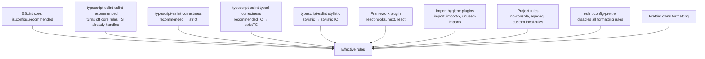
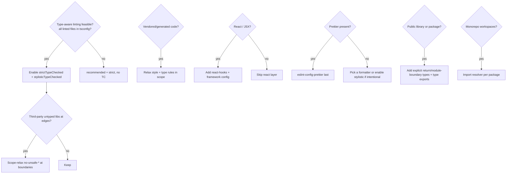

# TypeScript Strict Ruleset — Research (WIP)

> **Status:** Research largely complete; experiments E1–E8 run and recorded
> (see §10). Remaining before the final ruleset: resolve the two tuning
> decisions in §9.2 and fold results into the copy-paste artifact.
>
> **Date:** 2026-10-01 (research) · 2026-10-02 (experiments) · **Owner:** `myai` planning
>
> **Inputs:** `typescript-tooling-baseline.md` (settled stack),
> `setting-up-typescript-projects-plan.md`, current `typescript-eslint` preset
> source, and the two baseline repos `nextjs-template` and `4Cells_Core_Frontend`.
>
> **Output goal:** an advanced, opinionated, copy-paste ESLint + `tsconfig`
> ruleset plus a guide on how to adjust it so it "Just Works" and catches the
> most common bug/smell families.

## 0. TL;DR — key findings

1. **The presets are only the floor.** `strictTypeChecked` omits the
   highest-signal opinionated rules we care about: `strict-boolean-expressions`,
   `switch-exhaustiveness-check`, `explicit-function-return-type`,
   `no-restricted-types`, `consistent-type-imports`, `eqeqeq`, and import
   hygiene. These must be added by hand.
2. **Both baseline repos have a preset-wiring bug, and it is worse than silent
   gaps.** `...strictTypeChecked[1]?.rules` grabs the `eslint-recommended`
   compatibility object, not the rules object at `[2]`. Measured: the buggy form
   enables **47** rules vs **137** for the correct whole-array spread — **91
   typed rules lost**. Yet the config still pays the full type-program cost, so
   the repos spent ~17 s/run on an inert type check. This is the primary cause of
   the user's original slowness, not typed lint's inherent price.
3. **Performance verdict (E1).** Typed lint is ~0.37 s per 1k LOC, linear to
   200k LOC. On 37.6k LOC: untyped 3.9 s, typed `projectService` 22.7 s,
   `tsc --noEmit` 4.1 s warm. `--cache` makes a *no-change* run 1.1 s but a
   **one-file edit still costs ~7 s** (the cache does not cache the TS program).
   Recommendation: **typed lint at pre-commit/CI, untyped + `tsc --watch` for the
   edit loop.** Typed lint never replaces the tsc gate, so running both per-edit
   is double work.
4. **`verbatimModuleSyntax` (settled tsconfig) needs lint support that no preset
   provides:** `consistent-type-imports` + `no-import-type-side-effects`.
5. **ts-reset is conditionally safe.** The full `recommended` preset introduces
   unsoundness (`filter(Boolean)` suppresses real errors; literal-widening removes
   genuine `TS2345`s). A **safety-only subset** (`json-parse`, `fetch`,
   `promise-catch`, `map-constructor`, `is-array`) captures the `any→unknown`
   wins with zero reproduced downside.
6. **tsconfig split-env strategy corrected (E5).** `projectService` *does* consume
   split tsconfigs, but only via a solution root `{ "files": [], "references": [] }`
   with plain `noEmit` per-env configs. Do **not** combine include-all + references
   (TS6305/TS6310). Single-env projects keep one include-all root.
7. **Test zone (E7).** `unbound-method` is a non-configurable false positive under
   Vitest matchers → keep off in tests. Preserve the async/module core. Add
   `@vitest/eslint-plugin` (not the stale `eslint-plugin-vitest`). No `vitest/globals`
   (it leaks into app source); use explicit imports.
8. **One portable custom rule:** `no-process-env-in-src` (local plugin
   `local-rules`), shared identically by both repos.
9. **Two no-op traps found:** the repos' `explicit-function-return-type` block is
   **inert** (`allowFunctionsWithoutTypeParameters: true` exempts every
   non-generic function), and `object → Record<string, unknown>` is the wrong
   redirect (use `Partial<Record<string, unknown>>`).

## 1. Rule sources and the composition model

A "ruleset" is not one file. It is a stack, and understanding the stack is what
makes it adjustable.



| Layer | What it is | Changeability |
| --- | --- | --- |
| ESLint core (`@eslint/js`) | Language-agnostic correctness (`no-undef`, `no-eval`, `no-unreachable`…) | Fixed base; some entries disabled by TS layer |
| `eslint-recommended` | Disables core rules TS already checks; enables `no-var`, `prefer-const`, `prefer-rest-params`, `prefer-spread` | Always include with TS; non-negotiable |
| `recommended` / `strict` | Non-type-aware TS correctness | `recommended` default; `strict` recommended |
| `recommendedTypeChecked` / `strictTypeChecked` | Type-aware correctness; the real bug-catchers | The heart of the ruleset; highest cost |
| `stylistic` / `stylisticTypeChecked` | Best-practice style, no logic change | Opinionated; drop rules you disagree with |
| Plugins | Framework + import hygiene | Conditional on stack |
| Local rules | Project conventions (env, layer boundaries) | Custom per repo |

Current typescript-eslint preset topology (v8-era, verified against upstream
source):

```text
recommended                 = mind-the-gap correctness, no types needed
strict                      = recommended + stronger correctness
stylistic                   = best-practice style
recommended-type-checked    = recommended + type-aware correctness
strict-type-checked         = recommended + recommended-TC + strict + type-aware strict
stylistic-type-checked      = stylistic + type-aware style
disable-type-checked        = opt-out block for JS/config files under a typed config
```

Two mechanics matter:

- `strict*` configs are **supersets**: `strictTypeChecked` already contains
  `recommended`, `recommendedTypeChecked`, and `strict`. Do not stack them.
  **Our default baseline is `strictTypeChecked`, not `strict`** — `strict`
  (non-typed) leaves the entire async/unsafe bug family uncovered.
  `strictTypeChecked` is our "very strict" floor; `stylisticTypeChecked` is a
  separate, trimmed add-on.
- Use `projectService: true` (not `project: [...]`) for typed linting. **Measured
  (E1):** `projectService` is ~24% *slower* than `project` on full runs
  (it covers more files), but `project` cannot lint files excluded from the root
  tsconfig (tests/configs), so `projectService` + a solution-root `references`
  setup is required for the "all files typed" decision. See §3.4 and §10/E5.
- **Composition API:** `tseslint.config()` is deprecated in typescript-eslint
  8.71; use `defineConfig` from `eslint/config`. (Found by E2; the config errors
  on its own `no-deprecated` rule otherwise.)

## 2. Category map

Grouped by *what class of bug or smell it protects against*, with the preset that
carries it by default. `R`=recommended, `S`=strict, `ST`=stylistic, suffix `TC`=type-checked.
"Default" below means "on in `strictTypeChecked` + `stylisticTypeChecked`".

### 2.1 Type-escape and unsafe-`any` family (highest priority)

Protects against: `any` leaking through the codebase and silently disabling the
compiler. This is the most common cause of "types lie to me" runtime bugs.

| Rule | Preset | Notes |
| --- | --- | --- |
| `no-explicit-any` | R | Zero tolerance default |
| `no-unsafe-assignment` | RTC | Any assignment |
| `no-unsafe-member-access` | RTC | `any.property` |
| `no-unsafe-call` | RTC | Calling `any` |
| `no-unsafe-return` | RTC | Returning `any` |
| `no-unsafe-argument` | RTC | Passing `any` |
| `no-unsafe-unary-minus` | RTC | `-x` on non-number |
| `no-unsafe-enum-comparison` | RTC | Comparing unrelated enums |
| `no-unsafe-enum-assignment` | STC | Assigning across enums |
| `no-unsafe-declaration-merging` | R | Interface/class merge |
| `no-unsafe-function-type` | R | Bare `Function` |
| `no-explicit-any` + `no-restricted-types` | R / — | `object`, `{}`, etc. |
| `no-wrapper-object-types` | R | `Object`, `String`, `Number` |
| `no-empty-object-type` | R | `{}` |
| `no-unsafe-type-assertion` | — | **Not in any preset**; opt-in |
| `no-non-null-assertion` | S | Ban `!` |
| `no-non-null-asserted-optional-chain` | R | `a?.b!` |
| `no-non-null-asserted-nullish-coalescing` | S | `a! ?? b` |
| `no-extra-non-null-assertion` | R | `a!!` |
| `non-nullable-type-assertion-style` | STC | Prefer `!` style consistency |
| `consistent-type-assertions` | ST | `as` vs `<T>`; object-literal policy |
| `prefer-as-const` | R | literal widening |
| `ban-ts-comment` | R (+desc in S) | `@ts-ignore` etc. |

### 2.2 Nullability, boolean, and control-flow correctness

Protects against: null/undefined crashes, empty-string-as-false bugs, missing
switch cases, unreachable branches.

| Rule | Preset | Notes |
| --- | --- | --- |
| `strict-boolean-expressions` | — | **Not in presets.** Measured (E3): 2 findings on 21 fresh files; tuned options in §10/E3. |
| `no-unnecessary-condition` | STC | Catches always-true/false checks (and too-wide types) |
| `no-unnecessary-boolean-literal-compare` | STC | `x === true` |
| `switch-exhaustiveness-check` | — | **Not in presets.** Repos opt in. Essential for unions. |
| `prefer-nullish-coalescing` | STC | `??` over `||` |
| `prefer-optional-chain` | STC | `?.` over `&&` |
| `no-confusing-void-expression` | STC | arrow returning `void` in expression position |
| `no-meaningless-void-operator` | STC | `void void` |
| `no-unnecessary-type-conversion` | STC | `String(x)` where x is string |
| `no-unnecessary-template-expression` | STC | `${x}` alone |
| `no-base-to-string` | RTC | `String(obj)` / template on object |
| `no-mixed-enums` | STC | numeric+string enum members |

### 2.3 Async and promise correctness

Protects against: the classic Node/browser bug family — dropped promises,
unhandled rejections, async passed where void is expected, forgotten `await`.

| Rule | Preset | Notes |
| --- | --- | --- |
| `no-floating-promises` | RTC | **Gap in both repos** due to wiring bug |
| `no-misused-promises` | RTC | async handler where void expected |
| `await-thenable` | RTC | `await` on non-thenable |
| `only-throw-error` | RTC | throwing strings/objects |
| `prefer-promise-reject-errors` | RTC | reject non-Error |
| `require-await` | RTC | async with no await |
| `return-await` (`error-handling-correctness-only`) | STC | correct try/catch semantics |
| `use-unknown-in-catch-callback-variable` | STC | `catch` callback param |
| `promise-function-async` | — | opt-in, often too broad |
| `no-array-delete` | RTC | `delete arr[i]` leaves a hole |
| `no-for-in-array` | RTC | `for...in` over arrays |

### 2.4 Runtime/type-shape correctness

| Rule | Preset | Notes |
| --- | --- | --- |
| `restrict-template-expressions` | RTC (stricter in STC) | no implicit object stringification |
| `restrict-plus-operands` | RTC (stricter in STC) | no string+number accidents |
| `no-duplicate-type-constituents` | RTC | redundant unions |
| `no-redundant-type-constituents` | RTC | `string \| "a"` |
| `no-unnecessary-type-assertion` | RTC | redundant `as` |
| `no-unnecessary-type-constraint` | R | `<T extends unknown>` |
| `no-unnecessary-type-arguments` | STC | explicit default type args |
| `no-unnecessary-type-parameters` | STC | type param used once |
| `no-deprecated` | STC | use of `@deprecated` members |
| `no-misused-spread` | STC | spreading string/array into object |
| `no-useless-default-assignment` | STC | default that can never apply |
| `no-dynamic-delete` | S | `delete obj[k]` |
| `no-invalid-void-type` | S | bad `void` usage |
| `no-this-alias` | R | `const self = this` |
| `unbound-method` | RTC | detached class method. Measured (E7): non-configurable FP under Vitest matchers → off in tests. |
| `prefer-reduce-type-parameter` | STC | typed `reduce` |
| `prefer-return-this-type` | STC | fluent API return type |
| `related-getter-setter-pairs` | STC | getter/setter type mismatch |

### 2.5 Module and import hygiene

Protects against: dead imports, circular/duplicate imports, type-only import
mistakes under `verbatimModuleSyntax`.

| Rule | Preset | Notes |
| --- | --- | --- |
| `consistent-type-imports` | — | **Critical gap** for `verbatimModuleSyntax` |
| `no-import-type-side-effects` | — | side-effect-only type imports |
| `consistent-type-exports` | — | symmetric for exports |
| `no-require-imports` | R | ESM-only baseline |
| `no-duplicate-imports` (core/import) | — | repos disable `import/no-duplicates` |
| `import/order`, `import/first`, `import/newline-after-import` | — | plugin; repos use |
| `unused-imports/no-unused-imports` | — | plugin; autofixes removal |
| `no-unused-vars` (TS variant) | R/S | unused code |
| `no-unused-expressions` | R | dead expressions |
| `no-unused-private-class-members` | — | opt-in |

### 2.6 Style / consistency (subjective, zero logic impact)

Protects against: bikeshed churn and review noise, not bugs. Safe to trim.

| Rule | Preset |
| --- | --- |
| `array-type`, `consistent-type-definitions`, `consistent-indexed-object-style` | ST |
| `consistent-generic-constructors`, `class-literal-property-style` | ST |
| `no-inferrable-types`, `no-empty-function`, `prefer-for-of`, `prefer-function-type` | ST |
| `adjacent-overload-signatures`, `unified-signatures`, `ban-tslint-comment` | ST / S |
| `dot-notation`, `prefer-find`, `prefer-includes`, `prefer-regexp-exec`, `prefer-string-starts-ends-with` | STC |
| `no-inferrable-types`, `member-ordering`, `naming-convention` | — (opt-in, configurable) |
| `explicit-function-return-type` | — (repos' block is **inert**; see §10/E3) |
| `explicit-module-boundary-types` | — (library-oriented alternative) |

### 2.7 TypeScript-specific bans done via `no-restricted-types`

Not presets: `object`, `{}` (covered), `Function` (covered), plus project bans.

**Correction from review:** do **not** redirect `object` to
`Record<string, unknown>`. That claims every key exists with an `unknown` value,
which is false for the "some object" case. Use
`Partial<Record<string, unknown>>` (all keys optional) or a shared alias:

```ts
// e.g. types/unknown-record.ts
export type UnknownRecord = Partial<Record<string, unknown>>;
```

The repos' current `fixWith: 'Record<string, unknown>'` is therefore wrong and
should become `Partial<Record<string, unknown>>` (or the alias).

### 2.8 Framework layer

| Rule set | Inclusion factor |
| --- | --- |
| `react-hooks/rules-of-hooks`, `exhaustive-deps` | React present |
| `next/core-web-vitals` (via FlatCompat today) | Next.js present |
| `react/*`, `jsx-a11y/*` | React without Next, or a11y budget |
| `@typescript-eslint/no-confusing-void-expression` tuning | React event handlers return values → noisy |
| `@typescript-eslint/no-misused-promises` `checksVoidReturn` tuning | React `onClick={async fn}` false positives |

## 3. Default vs optional — the decision model

"Default" for us should mean: **on in every TypeScript app, non-negotiable**.
"Optional" means: inclusion is gated by a property of the project.



### 3.1 Non-negotiable defaults (all TS projects)

| Group | Why default |
| --- | --- |
| `eslint-recommended` | TS-aware base; prevents false positives from core |
| `strictTypeChecked` | The bug-catching core |
| `no-floating-promises`, `no-misused-promises`, `await-thenable` | Async bug family — top real-world crash source |
| `switch-exhaustiveness-check` | Union drift |
| `no-restricted-types` (`object`, `{}`, `Function`) | Type honesty |
| `consistent-type-imports` + `no-import-type-side-effects` | Required by our `verbatimModuleSyntax` baseline |
| `eqeqeq` | `==` coercion |
| `no-var`, `prefer-const` (from eslint-recommended) | Baseline hygiene |
| `ban-ts-comment` (with description length) | Escape-hatch discipline |
| `no-console` (with allow list) | Debug leakage |

### 3.2 Optional groups and their inclusion triggers

| Optional group | Include when | Skip/relax when |
| --- | --- | --- |
| `stylistic` / `stylisticTypeChecked` | Team wants enforced consistency | Team dislikes a rule (drop per-rule, not whole set) |
| `strict-boolean-expressions` | Team accepts explicit comparisons | Very noisy; needs `allowNullable*` tuning; skip in JS-heavy or legacy code |
| `explicit-function-return-type` | Public APIs / libraries / large teams | React components (inference is idiomatic); use tuned `allow*` options |
| `explicit-module-boundary-types` | Libraries with published types | Apps |
| `import/order` | Team wants deterministic import grouping | Prettier + `consistent-type-imports` may suffice |
| `unused-imports` plugin | Want `--fix` to delete dead imports | `no-unused-vars` already reports; plugin adds autofix |
| `naming-convention` | Strong naming policy | Config is large and easy to fight |
| `member-ordering` | Class-heavy codebase | Function/React codebase |
| `no-magic-numbers` | Numeric-domain code | Almost always too noisy; skip |
| `prefer-readonly-parameter-types` | Almost never | Enormously slow + noisy; do not enable |
| `no-deprecated` | Want deprecation pressure | Large legacy dep sets; can flood output |
| React/framework rules | React/Next present | non-React |
| `@total-typescript/ts-reset` | Want `any→unknown` at boundaries | Use **safety-only subset** — full preset is unsound (see §10/E4) |
| `eslint-config-prettier` | Always (Prettier is assumed) | Never omitted |

### 3.3 Inclusion factors (the "what affects whether it's in" list)

1. **Type info availability / performance budget** — typed rules only work when
   every linted file is in a tsconfig project. Tests and config files often are
   not, which is exactly why `disable-type-checked` exists.
2. **Framework** — React/Next pulls hooks + framework rules and forces
   tuning of `no-confusing-void-expression` and `no-misused-promises`.
3. **Vendored/generated code** — needs a relaxed scope (both repos do this for
   `components/ui/**` and `kbar/**`).
4. **Untyped third-party libraries** — forces scoped `no-unsafe-*` relaxations
   or typed wrappers/stubs.
5. **Library vs application** — return/module-boundary types matter for
   libraries, not apps.
6. **Formatter** — **Prettier is assumed always present**, so
   `eslint-config-prettier` (last layer) always applies and all formatting rules
   are permanently out of ESLint's hands. Do not design "no formatter" variants.
7. **Dev vs CI** — **rejected pattern.** The repos' `warnInDevModeErrorInProd`
   makes lint output depend on `NODE_ENV` and can hide errors in CI. We use
   **`error` everywhere**; warnings are a temporary migration ratchet only.
8. **Module system** — ESM-only baseline makes `no-require-imports` free;
   legacy/CJS is explicitly out of scope.
9. **Team taste** — stylistic rules are the adjustable dialect.
10. **Repo age/legacy** — out of scope per roadmap, but it is why some rules are
    written with `allow*` escape hatches.

## 3.4 Coverage strategy: include-all vs split envs (verified — E5)

Because we chose "all files typed" (`strictTypeChecked` everywhere), the tsconfig
shape is load-bearing. The experiments corrected the original plan.

**Key correction:** "include-all + exclude" **and** "split environments visible
to `projectService`" **cannot both hold**. Include-all root + `references` makes
`tsc` fail (TS6305/TS6310). `projectService` *does* consume split tsconfigs — but
only when a solution root references them.

| Strategy | Shape | Verdict |
| --- | --- | --- |
| Single include-all root | `include: ["**/*.ts(x)"]` + exclude generated; `projectService: true` | Use for **single-env** projects (e.g. Node-only). Root config files cost ~0 extra noise (E5). |
| **Solution root + references** | `tsconfig.json = {"files": [], "references": [src, node, test]}` + plain `noEmit` per-env configs; `projectService: true` | **Recommended for multi-env.** All categories typed, env leakage forbidden, `tsc -p <each> --noEmit` gate. No `composite`, no emit. |
| Legacy `project: [...]` array | list of tsconfigs | Works as a fallback for split envs, but `projectService` is preferred. |
| `allowDefaultProject` | default project carries `types: ["node"]` | Works but provides no env separation → not recommended. With `types: []` it storms `no-unsafe-*`. |

```text
# multi-env recommended set (E5 verbatim)
tsconfig.base.json   settled base (§3)
tsconfig.json        { "files": [], "references": [src, node, test] }
tsconfig.src.json    types: [], lib: [ESNext, DOM, DOM.Iterable]
tsconfig.node.json   types: ["node"]  -> *.config.ts, scripts/**, next-env.d.ts
tsconfig.test.json   types: ["node"]  -> tests/**, next-env.d.ts
typecheck:           tsc -p tsconfig.src.json --noEmit && tsc -p tsconfig.node.json --noEmit && tsc -p tsconfig.test.json --noEmit
```

An unreferenced split tsconfig is **invisible** to `projectService` (the original
base finding stands). Any directory excluded from the lint tsconfig must also be
ESLint-ignored, or `projectService` emits parse errors. `next-env.d.ts` must be
included in every env project, or `process.env` typing diverges (TS4111 vs TS2540).

## 4. Problematic rules and interactions

This is the section that makes the difference between a ruleset that "just
works" and one that gets disabled wholesale.

| Rule / group | Problem | Recommended handling |
| --- | --- | --- |
| `no-unnecessary-condition` | Reports defensive checks when types are too wide; can fight `noUncheckedIndexedAccess` expectations; false positives with some libs | **Measured (E3): aligned with `noUncheckedIndexedAccess`, not opposed.** Keep on; fix the *type*, relax in vendored scope. |
| `strict-boolean-expressions` | Noisy: bans `if (str)`, `if (count)` | **Measured (E3): 2 findings / 21 fresh files.** See §10/E3 for the tuned option set. |
| `explicit-function-return-type` | Noisy in React/inferred code; the repos' allow-list is **inert** | **Trap (E3):** `allowFunctionsWithoutTypeParameters: true` exempts every non-generic function. Set it `false` (or drop the rule if enforcement is unwanted). |
| `no-unsafe-*` family | Floods at untyped boundaries | Scope-relax per directory or wrap/stub the library; never blanket-disable |
| `no-floating-promises` | Requires `void` marker or handling | Keep error; allow `void promise` as explicit acknowledgment |
| `no-misused-promises` | `onClick={async () => …}` false positives | Set `checksVoidReturn: { attributes: false }` for React |
| `no-confusing-void-expression` | Redundant `void` / arrow-shorthand noise (E3: `setTimeout(() => resolve())` FP) | Set `ignoreArrowShorthand: true`. |
| `no-deprecated` | New in STC; can flood with old dependency types | Keep on in app code; disable for node_modules-typed legacy or relax to warn |
| `unbound-method` | FP with class methods passed to Vitest matchers (E7: non-configurable; only `ignoreStatic`) | Keep in src; **off in tests**, but keep `no-unsafe-call`/`no-unsafe-return`. |
| `eqeqeq` | `x == null` idiom | `['error','always',{ null: 'ignore' }]` if used |
| `no-empty-object-type` | Fires on `T extends {}` and empty React props | Keep; use `Record<string, never>` / proper props |
| `prefer-nullish-coalescing` | Can conflict with intentional `\|\|` on non-nullable strings | Keep; use `??`; disable per-line if genuinely intended |
| `prefer-optional-chain` | Occasionally less readable | Keep |
| `no-base-to-string` | Fires on objects with `toString` used intentionally | Keep; explicit `.toString()` or template board |
| `restrict-template-expressions` | Blocks numbers in templates (STC) | App repos may allow `allowNumber: true` |
| `require-await` | Flags async interface implementations with no await | Keep; remove `async` or add real await |
| `no-unnecessary-type-parameters` | New; false positives on single-use params with intent | Keep; consider relax if it fights generics |
| `no-misused-spread` | New; flags deliberate object spreads | Keep; fix |
| `consistent-type-definitions` | `interface` vs `type` bikeshed | Pick one; often `type` |
| `array-type` | `T[]` vs `Array<T>` bikeshed | Pick one; default `array-simple` |
| `import/no-duplicates` | History of false positives with type imports | Both repos disable it; prefer TS `consistent-type-imports` + core dedupe |
| Core `no-undef` | False positives on TS globals | Already off via `eslint-recommended` |
| `no-console` | Needed for CLIs/services | Allow `warn`/`error`, or disable for CLI entrypoints |
| `@typescript-eslint/no-unused-vars` vs TS `noUnusedLocals` | Duplicate diagnostics | **One owner**: ESLint owns it, keep tsconfig flags off (or vice versa — decide) |
| Typed lint performance | **Measured (E1):** ~0.37 s/kLOC linear (22.7 s @37.6k); `--cache` no-change 1.1 s but 1-file edit ~7 s; `projectService` ~24% slower than `project` full-run | Do not use typed lint as the per-save linter. Local: untyped + `tsc --watch`; commit: typed changed files; CI: full typed. See §10/E1. |
| `import/no-unresolved` + resolver | With `moduleResolution: bundler`, no `baseUrl`, `.ts` specifiers and subpath exports need a resolver | **Required:** `settings: { 'import/resolver': { typescript: { alwaysTryTypes: true } } }` (E6). Explicit `.ts` alone resolves via node resolver. |
| `consistent-type-imports --fix` | Autofix output is not Prettier-clean (`import type { Status} from …`) | Run Prettier after `eslint --fix` (E2/E6). |
| `warnInDevModeErrorInProd` pattern | Behavior depends on `NODE_ENV`; CI/prod mismatch can hide errors | Rejected. `error` everywhere; warnings only a temporary ratchet. |
| `next/core-web-vitals` via `FlatCompat` | Legacy bridge; slow and can conflict with flat-native configs | Prefer `@next/eslint-plugin-next` flat config / `eslint-config-next` flat when stable |

## 5. What the baseline repos actually do

Both repos share one template lineage; configs are ~identical.

### 5.1 The preset-wiring bug (important)

```ts
// nextjs-template/eslint.config.ts:65-69 and 4Cells:64-68
rules: {
  ...tseslint.configs.recommendedTypeChecked[1]?.rules,
  ...tseslint.configs.strictTypeChecked[1]?.rules,
}
```

`tseslint.configs.<preset>` is an array `[base, eslint-recommended, { rules }]`.
Index `[1]` is the `eslint-recommended` compatibility object, whose rules are
only core disables (`no-undef: off`, …) plus `no-var`, `prefer-const`,
`prefer-rest-params`, `prefer-spread`. The comment "Include ALL
typescript-eslint type-checking rules" is false; the actual typed rule object at
`[2]` is dropped. Consequences:

- Not applied from the preset: `no-floating-promises`, `no-misused-promises`,
  `await-thenable`, `require-await`, `restrict-template-expressions`,
  `restrict-plus-operands`, `no-base-to-string`, `no-array-delete`,
  `no-for-in-array`, `only-throw-error`, `prefer-promise-reject-errors`,
  `unbound-method`, `no-deprecated`, `no-confusing-void-expression`,
  `no-misused-spread`, and most `stylistic`/`stylisticTypeChecked` rules.
- Covered only because they were hand-listed: `no-explicit-any`,
  `no-unsafe-*`, `no-non-null-assertion`, `no-unnecessary-condition`,
  `no-unnecessary-type-assertion`, `switch-exhaustiveness-check`,
  `prefer-nullish-coalescing`, `prefer-optional-chain`, `strict-boolean-expressions`.

**Takeaway for our ruleset:** use the preset array correctly (spread the whole
array / `defineConfig`), then layer deltas. Never index into a preset.

**Quantified (E2):** correct whole-array spread enables **137** rules; the buggy
`[1]?.rules` form enables **47**; **91 typed rules lost** (70
`strict-type-checked` + 21 `stylistic-type-checked`, zero overlap). Because the
config still sets `parserOptions.project`, the repos pay the full type-program
cost (~17 s on 4cells) while the rules that justify it are inert — the root
cause of the reported slowness (E1). The correct config also finds real bugs the
repos miss: 13 `no-floating-promises`, 12 `no-misused-promises`, plus
`restrict-template-expressions`/`no-confusing-void-expression` hits.

### 5.2 Shared, portable custom rule: `no-process-env-in-src`

- Location: `scripts/eslint/rules/no-process-env-in-src.ts` (both repos, identical).
- Registered as local plugin `local-rules`, scoped to `src/**`, ignoring `src/env.ts`.
- Default allowlist `NODE_ENV`; configurable `allow: string[]`.
- Intent: force all env access through the validated `@/env` module
  (`@t3-oss/env-nextjs` + Zod).
- **Portability:** the rule itself is generic; only the `@/env` message and the
  ignored path are project-specific. Good candidate to generalize for
  `coding_rules_ts` ("no raw env in app source; use the validated config module").

### 5.3 Project-specific (not portable) customizations

| Item | Location | Why not portable |
| --- | --- | --- |
| `no-restricted-imports` banning `lucide-react` and `@/components/icons-legacy` | import block | Project icon policy |
| Relaxed rules for `src/components/ui/**`, `src/components/kbar/**` | last block | shadcn/vendor policy |
| `warnInDevModeErrorInProd()` for `no-console`, `no-unused-vars`, `import/*` | many | CI determinism concern |
| Next.js `next/core-web-vitals` via `FlatCompat` | top | Framework bridge |
| `import/order` with `@/**` path group and `type` group | import block | Good default, but tied to `@/` alias |
| Prettier + `prettier-plugin-tailwindcss` | `.prettierrc` | Tailwind |

### 5.4 Other gaps in the baselines

- `parserOptions.project: ['./tsconfig.json']`, but the tsconfig `exclude`s tests
  and the config globally ignores `__tests__`, `test`, `vitest.config.ts`,
  `playwright.config.ts`. Test and config files are **not linted at all** — the
  plan's requirement ("every source, test, script, configuration file covered")
  is not met.
- `tsconfig` has only `strict` + `noUncheckedIndexedAccess` + `forceConsistentCasingInFileNames`
  beyond Next defaults. Missing vs our settled base: `verbatimModuleSyntax`,
  `isolatedModules` (both pins have `isolatedModules`), `exactOptionalPropertyTypes`,
  `noImplicitOverride`, `noFallthroughCasesInSwitch`, `noUncheckedSideEffectImports`.
- `reset.d.ts` uses `@total-typescript/ts-reset` (full `recommended`). **E4: use
  the safety-only subset instead** — the full preset is unsound (`filter(Boolean)`
  hides real errors; literal widening removes genuine `TS2345`s). See §10/E4.

## 6. Gaps between our settled baseline and preset coverage

Driven by `typescript-tooling-baseline.md` tsconfig:

| Settled tsconfig flag | Required lint support | In presets? |
| --- | --- | --- |
| `verbatimModuleSyntax: true` | `consistent-type-imports`, `consistent-type-exports`, `no-import-type-side-effects` | **No** |
| `isolatedModules: true` | minimal; `verbatimModuleSyntax` covers | n/a |
| `noUncheckedIndexedAccess: true` | `no-unnecessary-condition` (STC), careful with `strict-boolean-expressions` | mostly |
| `noImplicitOverride: true` | compiler-only | n/a |
| `noFallthroughCasesInSwitch: true` | `switch-exhaustiveness-check` complements it | **No** (rule not in presets) |
| `allowImportingTsExtensions` + explicit `.ts` imports | import resolver must resolve `.ts`; avoid `import/extensions` forcing `.js` | **No** (plugin config) |
| `moduleResolution: bundler` | `import/no-unresolved` needs `import-resolver-typescript` or disable | **No** (plugin config) |
| No `baseUrl` in base config | path aliases only via `paths`; import plugin needs explicit config | n/a |

**Resolved (E5):** all four candidates —
`exactOptionalPropertyTypes` (TS2375), `noImplicitReturns` (TS2366),
`noUncheckedSideEffectImports` (TS2882), `noPropertyAccessFromIndexSignature`
(TS4111) — are accepted by TS 6.0.3, each fires on a minimal violation, and
produce no ESLint storm. Add all four to the strict base. (Only duplicate was
`import/no-unresolved` on a deliberately missing side-effect import.)

## 7. Verified ruleset architecture

```text
eslint.config.ts  (defineConfig from 'eslint/config' — NOT tseslint.config, deprecated)
1. ignores
2. js.configs.recommended
3. ...strictTypeChecked          (whole array)
4. ...stylisticTypeChecked       (whole array; trimmed)
5. parserOptions: { projectService: true, tsconfigRootDir: import.meta.dirname }
6. our opinionated deltas        <- the personal layer (see §10/E3 options)
     consistent-type-imports / no-import-type-side-effects
     switch-exhaustiveness-check
     strict-boolean-expressions (tuned)
     explicit-function-return-type (tuned, allowFunctionsWithoutTypeParameters: false)
     no-restricted-types (object -> Partial<Record<string, unknown>>)
     eqeqeq, no-console, no-confusing-void-expression tuning
     import plugin + resolver
7. vendored/generated scope relaxations
8. test zone delta + @vitest/eslint-plugin   (see §7.5)
9. local rules (env access, layer boundaries)
10. eslint-config-prettier  (last)
```

Design rules this research *proved*:

- Copy the **whole preset array**, never index into it (47 vs 137 rules).
- Use `defineConfig`; `tseslint.config` is deprecated and trips `no-deprecated`.
- One owner for unused-code (ESLint) and for formatting (Prettier).
- `error` everywhere; no `NODE_ENV`-dependent severities.
- Keep the personal layer **small and named** — each delta maps to a bug family.
- Every relaxation is scope-based, never a blanket disable.
- tsconfig strict flags and ESLint rules move together; `verbatimModuleSyntax`
  without `consistent-type-imports` is the canonical example.
- Local = untyped + `tsc --watch`; commit = typed changed files; CI = full typed.
- After `eslint --fix` on type imports, run Prettier (autofix is not format-clean).

## 7.5 Test files vs source — a deliberately modified ruleset

Tests are not "source code with extra allowances". They are a distinct zone with
different trust boundaries: fixtures are intentionally partial, mocks are
intentionally untyped, assertions deliberately poke at invalid states, and the
test framework injects globals. Applying the src ruleset unchanged produces a
stream of false positives that teaches the team to disable rules wholesale —
the exact failure mode we want to avoid.

**Confirmed empirically (E7).** The three specifics that were worth measuring:

1. `unbound-method` is a **non-configurable false positive** under Vitest matchers
   (`expect(obj.method).toHaveBeenCalled()` fires; only `ignoreStatic` exists, no
   Jest/Vitest allowlist) → it must be off in tests.
2. Tests are typed via the same solution-root `projectService` setup as the app
   (no separate test project needed for lint); `tsconfig.test.json` is still used
   for the `tsc` gate.
3. `@vitest/eslint-plugin` (1.6.x) adds signal; the legacy `eslint-plugin-vitest`
   misses `no-focused-tests`/`no-disabled-tests`/`no-conditional-expect`.

Confirmed: no `vitest/globals` (it leaks `describe`/`it` into app source) — use
explicit `import { describe, it, expect } from 'vitest'`.

### 7.5.1 The model

```text
tests = same typed core
        + test globals & test-framework plugin rules
        - src-only opinionated rules that fight fixtures/mocks
        (identified, scoped, and named — never "disable everything")
```

### 7.5.2 Keep identical (do not weaken in tests)

These catch real bugs in tests too, and tests are exactly where dropped promises
hide.

| Rule | Why keep |
| --- | --- |
| `no-floating-promises`, `no-misused-promises`, `await-thenable` | Async test leaks / false-green |
| `consistent-type-imports`, `no-import-type-side-effects` | Same module discipline |
| `no-unsafe-call`, `no-unsafe-return` (targeted) | Keep call/return honest even if assignment relaxes |
| `eqeqeq`, `prefer-const`, `no-var` | Baseline hygiene |
| Core correctness (`no-unreachable`, `no-dupe-*`) | Same |

### 7.5.3 Relax in tests (final, E7-verified)

| Rule | Why it fights tests |
| --- | --- |
| `no-explicit-any`, `no-unsafe-assignment`, `no-unsafe-member-access`, `no-unsafe-argument` | Mock/fixture builders cross untyped boundaries deliberately |
| `no-non-null-assertion` | `fixtures[0]!` after `expect(...).toHaveLength(1)` |
| `unbound-method` | **Confirmed non-configurable FP** under Vitest matchers |
| `no-unnecessary-condition` | Narrowly-typed fixtures make defensive asserts "unnecessary" |
| `strict-boolean-expressions` | Truthiness in assertion scaffolding |
| `no-console` | Intentional test diagnostics |
| `no-deprecated` | Tests may deliberately exercise deprecated APIs |

Dropped from the earlier draft: `explicit-function-return-type` (already inert
via `allowFunctionsWithoutTypeParameters` — no-op), `no-empty-function` (off
globally already). `ban-ts-comment` stays ON (E7: `@ts-expect-error` is already
permitted with a description; the min-10 threshold is kept).
`no-unsafe-return`/`no-unnecessary-type-assertion` stay ON (E7 fixed the fixtures
rather than relaxing).

### 7.5.4 Add in tests

| Rule / plugin | Purpose |
| --- | --- |
| Explicit `import { describe, it, expect } from 'vitest'` | Do **not** use `vitest/globals` (leaks into app source) |
| `@vitest/eslint-plugin` (1.6.x) | `no-focused-tests`, `no-disabled-tests`, `expect-expect`, `valid-expect`, `no-conditional-expect`, `no-standalone-expect`. Tune `expect-expect` with `assertFunctionNames: ['expect','expectTypeOf','assertType','assert']` |
| `eslint-plugin-testing-library` (frontend) | Deferred until a React fixture exists |
| `eslint-plugin-playwright` (e2e) | `no-focused-test`, `no-skipped-test`, `valid-expect`, `no-wait-for-timeout` |

### 7.5.5 Typed-lint wiring for tests

Tests are typed by the same solution-root `projectService` (no extra ESLint
config). `tsconfig.test.json` (referenced from the solution root) provides the
`tsc` gate. No `allowDefaultProject` needed.

### 7.5.6 Why this is not just "more permissive"

The deltas are **rule-specific and zone-scoped**. A blanket
`files: ['**/*.test.*'], rules: {...all off...}` (the common shortcut) loses the
async and module discipline that matters most in tests. E7 proved the async core
still fires in tests (`no-floating-promises`, `no-misused-promises`,
`await-thenable`, `consistent-type-imports` stay ON). The guide presents the
named delta table, not an off switch.

**Final test override block (E7-verified, verbatim):**

```ts
// same typed core; only untyped boundaries relax
{
  files: ['**/*.test.ts', '**/*.test.tsx', '**/*.spec.ts', '**/tests/**'],
  rules: {
    '@typescript-eslint/no-explicit-any': 'off',
    '@typescript-eslint/no-unsafe-assignment': 'off',
    '@typescript-eslint/no-unsafe-member-access': 'off',
    '@typescript-eslint/no-unsafe-argument': 'off',
    '@typescript-eslint/no-non-null-assertion': 'off',
    '@typescript-eslint/no-unnecessary-condition': 'off',
    '@typescript-eslint/strict-boolean-expressions': 'off',
    '@typescript-eslint/no-deprecated': 'off',
    '@typescript-eslint/unbound-method': 'off',
    'no-console': 'off',
  },
},
{
  files: ['**/*.test.ts', '**/*.test.tsx', '**/*.spec.ts', '**/tests/**'],
  plugins: { vitest },
  rules: {
    'vitest/no-focused-tests': 'error',
    'vitest/no-disabled-tests': 'error',
    'vitest/expect-expect': ['error', {
      assertFunctionNames: ['expect', 'expectTypeOf', 'assertType', 'assert'],
    }],
    'vitest/valid-expect': 'error',
    'vitest/no-conditional-expect': 'error',
    'vitest/no-standalone-expect': 'error',
  },
},
```

## 8. Simplification / "Just Works" levers

What makes the ruleset adjustable rather than brittle:

| Lever | Effect |
| --- | --- |
| Preset → delta layering | Trim by dropping one named block |
| Scope blocks (vendored, boundaries, config files) | Relax without weakening the whole repo |
| `projectService` + `allowDefaultProject` | Typed lint that survives config/test files |
| Per-rule options (`strict-boolean-expressions`, `explicit-function-return-type`, `no-misused-promises`) | Tune signal without disabling |
| One formatter (Prettier) + `eslint-config-prettier` | Removes stylistic conflicts |
| `no-restricted-types` / `no-restricted-imports` | Express local bans declaratively instead of custom rules |
| Local plugin only for genuinely structural rules (env, layer boundaries) | Fewer custom rules to maintain |

## 9. Decisions and open questions

### 9.1 Decided (this pass)

| # | Question | Decision |
| --- | --- | --- |
| 1 | Typed-linting scope | **All files in tsconfig.** Tests, scripts, and configs each covered by a project; type-aware linting everywhere. `disable-type-checked` used only where a file genuinely cannot be typed. |
| 2 | `strict-boolean-expressions` | **Default on, keep strict:** `{allowString:false, allowNumber:false, allowNullableObject:true, allowNullableBoolean:true, allowNullableString:false, allowNullableNumber:false, allowAny:false}`. E3: 2 findings/21 files — accepted. |
| 3 | `explicit-function-return-type` | **Default on, enforce:** set `allowFunctionsWithoutTypeParameters: false` (the repos' `true` made it inert). |
| 4 | Severity policy | **`error` everywhere.** Warnings only as a short-lived migration ratchet, never a permanent dev/prod split. |
| 5 | Unused-code owner | **ESLint.** `no-unused-vars` with `_`-ignore patterns; tsconfig `noUnusedLocals`/`noUnusedParameters` off. |
| 6 | `stylisticTypeChecked` | **Trimmed named subset.** Drop (`array-type`, `consistent-type-definitions`, `no-empty-function` at minimum); keep the rest unless noisy. |
| 7 | `ts-reset` | **Include safety-only subset** (`json-parse`, `fetch`, `promise-catch`, `map-constructor`, `is-array`). Full `recommended` is unsound (E4). |
| 8 | Custom rules | **Promote** `no-process-env-in-src` and **add** a layer-boundary rule in a small maintained `coding_rules_ts` local plugin. |
| 9 | Baseline preset | **`strictTypeChecked`** (NOT `strict`); spread the whole array. `stylisticTypeChecked` separate + trimmed. Never stack `strict*`. |
| 10 | tsconfig coverage | **Corrected:** single include-all root for single-env; **solution root `{files:[],references}` + per-env `noEmit` configs** for multi-env. Never include-all + references. `projectService: true`. |
| 11 | `object` ban redirect | **`Partial<Record<string, unknown>>`** (or `UnknownRecord` alias), NOT `Record<string, unknown>`. E8 confirmed. |
| 12 | All four candidate strict flags | **Accepted:** `exactOptionalPropertyTypes`, `noImplicitReturns`, `noUncheckedSideEffectImports`, `noPropertyAccessFromIndexSignature` (E5). |
| 13 | Composition API | Use **`defineConfig`** from `eslint/config`; `tseslint.config` is deprecated (E2). |
| 14 | Typed-lint cadence | Local = untyped `eslint --cache` + `tsc --watch`; commit = typed on changed files; CI = full typed. E1. |
| 15 | Import resolver | **Required:** `settings: { 'import/resolver': { typescript: { alwaysTryTypes: true } } }` (E6). |

### 9.2 Still open (before the final artifact)

- **Framework config approach** (React/Next): flat-native vs `FlatCompat` bridge —
  belongs to `setting-up-react-projects`, deferred.
- **Layer-boundary custom rule semantics** (which layers, how declared) — design
  task for the `coding_rules_ts` plugin.
- **Final artifact placement/format** — mirror `coding_rules_python`'s
  `rules/` + `templates/`? (see §11).

Research is otherwise complete; all §9.1 decisions are settled and the two
tuning questions are now resolved.

## 10. Experiments run and results

All experiments executed 2026-10-02 in isolated sandboxes under
`/tmp/opencode/ruleset/`, on the settled stack (Node 24.15.0, pnpm 12.8.1,
TypeScript 6.0.3, ESLint 9.39.5, typescript-eslint 8.71.0, Prettier 3.9.9).
Every `node_modules` created during experimentation was deleted afterwards. Raw
reports: `/tmp/opencode/ruleset/<experiment>/REPORT.md`.

| Experiment | Outcome in one line |
| --- | --- |
| E1 perf | typed lint ~0.37 s/kLOC; not viable per-edit; keep at commit/CI |
| E2 wiring | correct spread = 137 rules, buggy `[1]` = 47 (91 lost) |
| E3 noise | ruleset livable on fresh code; 2 tuning traps found |
| E4 ts-reset | full preset unsound → safety-only subset |
| E5/E6 tsconfig | solution-root references is the winning shape |
| E7 test zone | `unbound-method` FP; final delta + `@vitest/eslint-plugin` |
| E8 interop | 13 known rule interactions catalogued |

### E1 — Typed-lint performance (gating) — **done**

**Corpora:** real `4Cells_Core_Frontend` (338 files / 37.6k LOC) and
`nextjs-template` (191 / 17.6k LOC), plus a synthetic scaling corpus. All medians
of ≥3 runs, shared 12-core/23 GiB box (load1 ≈ 2.5–4.2).

| variant | 4cells | nextjs |
| --- | --- | --- |
| `tsc --noEmit` cold / warm | 10.05 / 4.07 s | 8.39 / 3.92 s |
| eslint repo-as-is | 17.02 s | 12.40 s |
| eslint **untyped** floor | 3.89 s | 2.79 s |
| eslint typed `project` | 18.28 s | 12.28 s |
| eslint typed `projectService` | 22.71 s | 17.58 s |
| typed service `--cache`, 0 changed files | 1.15 s | 1.09 s |
| typed service, **1 file changed** | 7.05 s | — |
| untyped single file | 1.09 s | — |
| tseslint 8.46 vs 8.71 | no meaningful diff | — |

Scaling: `time ≈ 0.68 + 0.371·kLOC` (R²=0.9975) to 200k LOC; RSS ≈12.5 MB/kLOC
(2.65 GiB @200k). Linear, no blow-up.

**Cause of the original 4cells slowness:** misconfiguration + duplicated work,
not inherent typed cost. `"lint": "tsc --noEmit && eslint . --fix --cache && pnpm format"`
builds the TS program twice (~21 s warm / ~27 s cold); the eslint run pays the
full type-program cost but the `[1]` bug makes the typed rules inert. Inherent
typed cost is 18–23 s full, 7 s/edit.

**Verdict / budget:** per-edit bar ≤2 s is not met by typed lint (7 s/edit;
`--cache` only helps a zero-change run). **Use option (c):** local
`eslint --cache` (untyped, changed files) + `tsc --watch`; pre-commit typed
`projectService` on changed files (~7 s); CI full typed + `tsc --noEmit`. Fix the
`[1]` bug first. oxlint typed (`--type-aware --type-check`) is ~30× faster
(0.78 s) but is TS7/typescript-go, rejects `baseUrl` (mass TS2307 false
positives), and is not a tsc replacement → opt-in supplement only after a
`baseUrl` migration.

### E2 — Correct preset wiring — **done**

Preset array = `[base(0), eslint-recommended(1), typed-rules(2)]`. Correct
whole-array spread **137** rules; buggy `[1]?.rules` **47**; **91 lost** (70
`strict-type-checked` + 21 `stylistic-type-checked`). Added deltas (+8):
`consistent-type-imports`, `explicit-function-return-type`,
`no-import-type-side-effects`, `no-restricted-types`,
`strict-boolean-expressions`, `switch-exhaustiveness-check`, `eqeqeq`,
`no-console`. Trim removes `array-type`, `consistent-type-definitions`,
`no-empty-function`. **`tseslint.config` is deprecated → `defineConfig`.**

### E3 — Noise audit on fresh code — **done**

21 fresh idiomatic files → **5 errors total**; ruleset is livable.

| rule | count | TP/FP |
| --- | --- | --- |
| `strict-boolean-expressions` | 2 | FP `if (value)` non-null string; TP `count ? count : 0` |
| `prefer-nullish-coalescing` | 1 | TP (same site; `?? 0` clears both) |
| `no-confusing-void-expression` | 1 | FP `setTimeout(() => resolve())` |
| `no-unnecessary-type-parameters` | 1 | TP |

Tuning that resulted:

- `strict-boolean-expressions`: keep strict `{allowString:false, allowNumber:false,
  allowNullableObject:true, allowNullableBoolean:true, allowNullableString:false,
  allowNullableNumber:false, allowAny:false}` **or** relax string/number to `true`
  (removes the `if (nonNullString)` FP while still catching nullable string/number).
  **Decision pending (§9.2).**
- `explicit-function-return-type`: **inert as the repos configured it**
  (`allowFunctionsWithoutTypeParameters: true` exempts all non-generic functions).
  Set it `false` to actually enforce; otherwise drop.
- `switch-exhaustiveness-check`: keep; a `default:` does **not** satisfy it;
  escape via `considerDefaultExhaustiveForUnions: true`.
- `no-unnecessary-condition`: keep — **aligned** with `noUncheckedIndexedAccess`.
- `no-unsafe-*`: keep; correct boundary pattern is
  `const x: unknown = JSON.parse(...)` then narrow — zero errors, no `any`.
- `no-restricted-types`: keep; `object` → `Partial<Record<string, unknown>>` passes.
- `consistent-type-imports` + `no-import-type-side-effects`: keep; autofix is not
  Prettier-clean — run Prettier after `eslint --fix`.
- `eqeqeq`: use `{ null: 'ignore' }` if the `x == null` idiom is wanted.
- `no-confusing-void-expression`: `ignoreArrowShorthand: true`.

**E8 interactions (13):** verbatim+`.ts`+allowImportingTsExtensions compatible;
type-import triple coordinated; type-import autofix vs Prettier formatting;
`import/order`+resolver works; unresolved import → `no-unsafe-argument` cascade;
`strict-boolean-expressions` ↔ `prefer-nullish-coalescing` same site;
`no-unnecessary-condition` ↔ `noUncheckedIndexedAccess` aligned;
`no-restricted-types` ↔ `no-empty-object-type` overlap;
`explicit-function-return-type` self-neutralizing; `no-confusing-void-expression`
↔ arrow shorthand; `eqeqeq` ↔ `== null`; **any eslint-ignored dir must be
tsconfig-excluded and vice-versa** (else `projectService` parse errors);
`strictTypeChecked` alone lacks the six manual adds.

### E4 — ts-reset — **done (conditional keep)**

Full `recommended` preset is **not harmless**: `filter(Boolean)` suppresses 2 real
type errors; literal widening of `.includes/.indexOf/Set.has/Map.has` removes 6
genuine `TS2345`s; introduces 2 new ESLint FPs (`no-unnecessary-condition` +
`strict-boolean-expressions`). Wins (`any→unknown`): `JSON.parse`,
`Response.json()`, `Promise.catch/then`, `new Map()`, `Array.isArray`.

**Use the safety-only subset** (no reproduced downside):

```ts
// src/reset.d.ts
import '@total-typescript/ts-reset/json-parse';
import '@total-typescript/ts-reset/fetch';
import '@total-typescript/ts-reset/promise-catch';
import '@total-typescript/ts-reset/map-constructor';
import '@total-typescript/ts-reset/is-array';
```

Exclude `filter-boolean`, `array-includes`, `array-index-of`, `set-has`,
`map-has`. Wiring: include-all/solution-root tsconfig picks up `src/reset.d.ts`
via `**/*.ts`; excluding `**/*.d.ts` silently disables it. No dep/peer-dep
conflict with our stack.

### E5 + E6 — tsconfig coverage + module interop — **done**

Winner: **solution root + references** (see §3.4 for the verbatim file set).
`projectService` consumes split configs via root `references`; unreferenced
configs are invisible. Include-all + references → TS6305/TS6310 (do not combine).
Root-config noise ≈ **0** in one include-all program (`eslint.config.ts`,
`vitest.config.ts`, `next.config.ts` clean even with `types: []`). Candidate
flags all accepted and fire. Exact import settings:

```ts
settings: {
  'import/parsers': { '@typescript-eslint/parser': ['.ts', '.tsx'] },
  'import/resolver': { typescript: { alwaysTryTypes: true } },
},
```

`rewriteRelativeImportExtensions` rewrites `./math.ts`→`./math.js` on build;
ESLint stays silent on `.ts` specifiers. `next-env.d.ts` must be included in
every env project (hidden `process.env` augmentation coupling).

### E7 — Test zone — **done**

`unbound-method` is a non-configurable FP under Vitest matchers → off in tests.
Async/module core preserved. `@vitest/eslint-plugin` (1.6.x) chosen. No
`vitest/globals`. Final override block in §7.5.6.

**Environment corrections found:** pnpm is **12.8.1** (not 10.21.0); 4cells
resolves typescript-eslint **8.71.0**; corpora run TS **5.7.2** while the settled
baseline targets TS 6.x.

**Next:** both tuning decisions are resolved (§9.1 #2/#3). Research is complete —
proceed to the final artifact (§11).

## 11. Final artifact — staged for review

Staged (not yet promoted) under `myai/docs/typescript-ruleset/`:

```text
docs/typescript-ruleset/
├── README.md                       Copy-paste ruleset + adjustment guide
└── templates/
    ├── eslint.config.ts            defineConfig; presets + deltas + test zone + resolver
    ├── tsconfig.base.json          Settled strict base (+ 4 accepted flags)
    ├── tsconfig.json               Solution root (references)
    ├── tsconfig.src/node/test.json Per-env configs
    ├── reset.d.ts                  ts-reset safety-only subset
    ├── .prettierrc                 trailingComma: all
    ├── .prettierignore
    └── package.scripts.json        scripts + local/commit/CI cadence
```

**Verified end-to-end (E-verify):** on a fresh Node ESM project the templates
typecheck, lint, format, and test green after four packaging fixes (all applied):
D1 `eslint.config.ts` import order; D2 Prettier-align templates; D3 add
`.prettierignore`; D4 add `jiti` + pin `typescript@~6.0`, `eslint@^9`. All 9 rule
families fired as intended; `unbound-method` stayed off in tests; autofix
round-trip (TS1484 → `lint:fix` → typecheck/lint/format) clean. `strict-boolean`
options and enforced `explicit-function-return-type` confirmed. Note: literal
unpinned install resolves TypeScript 7 / ESLint 10, and typescript-eslint 8
**refuses TS 7** — pinning is mandatory.

**Promotion target (after review):** `coding_rules_ts`, mirroring
`coding_rules_python` (`rules/` + `templates/`). Skill file
(`setting-up-typescript-projects/SKILL.md`, roadmap Phase 1) is a separate pass.

## 12. Corrections log

- E1: `pnpm` is 12.8.1; 4cells typescript-eslint 8.71.0; corpora TS 5.7.2.
- E2: `tseslint.config` deprecated → `defineConfig`; 91 rules lost by `[1]` bug.
- E3: `explicit-function-return-type` allow-list inert; `no-unnecessary-condition`
  aligned with `noUncheckedIndexedAccess` (not opposed).
- E4: full ts-reset preset unsound; safety-only subset.
- E5: split envs work only via solution-root `references`; include-all +
  references is invalid; root-config noise ≈ 0.
- E6: `eslint-import-resolver-typescript` required; `next-env.d.ts` in every env.
- E7: `unbound-method` non-configurable FP under Vitest; use
  `@vitest/eslint-plugin`, not `eslint-plugin-vitest`; no `vitest/globals`.
- Verify: literal unpinned install resolves TS 7 / ESLint 10 and
  typescript-eslint 8 refuses TS 7 → pin `typescript@~6.0`, `eslint@^9`; config
  loading needs `jiti`; templates must be Prettier-clean and ship a
  `.prettierignore`.
