# Skill Map

This is the central map for the skill set in this repository.

Use this file to understand:

- how skills are organized conceptually
- which workflows compose multiple skills
- which skills fit feature, bugfix, greenfield, review, research, and release work
- how the flat `skills/` directory relates to generated platform mirrors
- which tags and workflow maps should be used when updating skill files later

For the philosophy behind this map, see `../SKILLS-PHILOSOPHY.md`.

## Directory Model

`skills/` is intentionally flat and canonical.

```text
skills/
|-- api-design/
|   \-- SKILL.md
|-- systematic-debugging/
|   \-- SKILL.md
|-- verification-before-completion/
|   \-- SKILL.md
\-- ...
```

The category structure below is logical, not physical. Do not move skill folders
into nested category directories unless platform discovery and mirror generation
are redesigned first.

Generated mirrors:

```text
.agents/skills/<skill-name> -> ../../skills/<skill-name>
.claude/skills/<skill-name> -> ../../skills/<skill-name>
```

Refresh mirrors with:

```bash
./upd-repo-symlinks.sh
```

## Layer Model

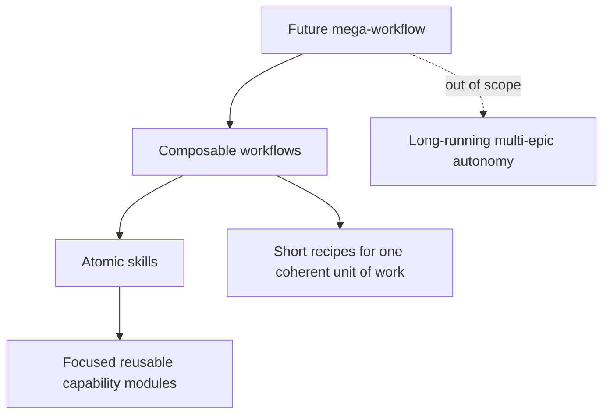

| Layer | Role | Current status |
| --- | --- | --- |
| Atomic skills | Focused capabilities loaded for concrete needs | Implemented as `skills/*/SKILL.md` |
| Composable workflows | Short explicit recipes made from several skills | Documented here and inside some skills |
| Mega-workflow | Long-running multi-epic autonomous orchestration | Out of scope for now |

## Skill Relationship Rules

This map uses only canonical skill names that exist under `skills/`.

Skill files that participate in a named workflow should include a small workflow
map near the top of `SKILL.md`, before detailed instructions. This helps agents
understand related skills at runtime.

Good workflow maps show:

- the current skill's place in the workflow
- sibling skills that may need to be loaded
- conditional branches, not mandatory chains
- next steps as recommendations, not required phase transitions
- final verification or handoff points when relevant

Recommended shape:

```text
current-skill
  -> next-skill                 (normal next step)
  -> optional-skill             (only when condition is true)
  -. soft recommendation .-> later-workflow
```

Good references in the current set:

- `high-level-testing-strategy` has a compact testing skill map.
- `planning-implementation` shows planning outputs and review checkpoints.

## Tag Policy

Tags are a relationship vocabulary for humans and agents and for future skill metadata
updates later. They should explain where a skill lives in workflows, not provide
a one-off label for every topic.

Rules:

- Use lowercase kebab-case tags only.
- Give a skill 1 to 4 tags, as useful.
- Reuse tags across multiple skills.
- Avoid one-time tags unless more skills with that tag are expected soon.
- Skills in the same workflow should share a workflow tag.
- Prefer workflow and relationship tags over product or technology labels.
- Do not use tags to reference skills that are not canonical in this repo.

Store tags in skill frontmatter as `metadata.tags`, using a comma-separated
string to stay compatible with platforms that treat `metadata` as a string map:

```yaml
metadata:
  tags: planning, implementation, verification
```

This is intentionally not YAML-native `tags: [planning, implementation]`.
Some skill formats use top-level tag arrays, but OpenCode and the Agent Skills
spec currently treat `metadata` as the portable extension point and expect its
values to be strings. If this repository later targets a consumer that supports
first-class tag arrays, migrate deliberately instead of keeping duplicate tag
sources in sync.

Shared workflow tags:

| Workflow area | Shared tag | Core skills |
| --- | --- | --- |
| Planning / Ideation | `planning` | `idea-sharpening`, `brainstorming`, `planning-implementation` |
| Implementation loop | `implementation` | `incremental-implementation`, `verification-before-completion`, `git-workflow` |
| Testing | `testing` | `high-level-testing-strategy`, `architecting-test-infra`, `test-driven-development`, `manual-testing` |
| Debugging / Bug prevention | `debugging` | `systematic-debugging`, `bug-root-cause-tracing`, `bug-protection-multi-layered` |
| Review / Feedback | `review` | `doing-code-review`, `receiving-code-review`, `verification-before-completion` |
| Parallel / Subagent work | `orchestration` | `when-and-how-to-run-parallel-agents`, `executing-plans-with-subagents` |
| Research | `research` | `upstream-source-research`, `ai-edge-research` |
| Release / Operations | `release` | `ci-cd-and-automation`, `release-automation-small-repos`, `shipping-and-launch` |

Common relationship tags:

```text
architecture, automation, boundaries, design, documentation, domain,
hardening, ideation, operations, quality, risk-reduction, root-cause,
subagents, upstream, verification
```

## Catalog

The catalog lists every canonical skill once, grouped by its primary role.

### Planning And Design

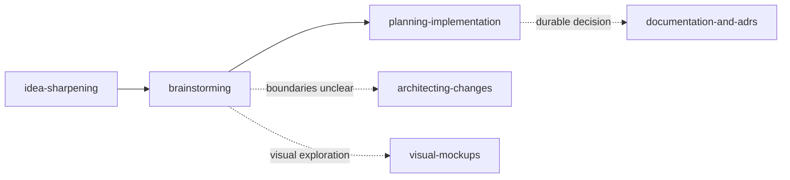

| Skill | Primary role | Tags |
| --- | --- | --- |
| `idea-sharpening` | Refine vague ideas into sharper concepts | planning, ideation, risk-reduction |
| `brainstorming` | Turn understood features into technical specs | planning, ideation, design |
| `planning-implementation` | Break specs into ordered, verifiable tasks | planning, implementation, verification |
| `architecting-changes` | Decide boundaries, ownership, and routing | planning, architecture, boundaries |
| `visual-mockups` | Explore UI layouts and diagrams visually with the human | planning, design |
| `documentation-and-adrs` | Preserve durable decisions and agent-facing context | planning, documentation, architecture |

### Implementation And Verification

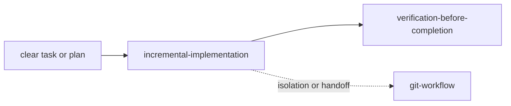

| Skill | Primary role | Tags |
| --- | --- | --- |
| `incremental-implementation` | Execute thin verified slices | implementation, verification, quality |
| `verification-before-completion` | Require evidence before success claims | implementation, verification, review, quality |
| `git-workflow` | Manage branches, worktrees, staging, commits, and handoff | implementation, orchestration, quality |

### Agent Orchestration

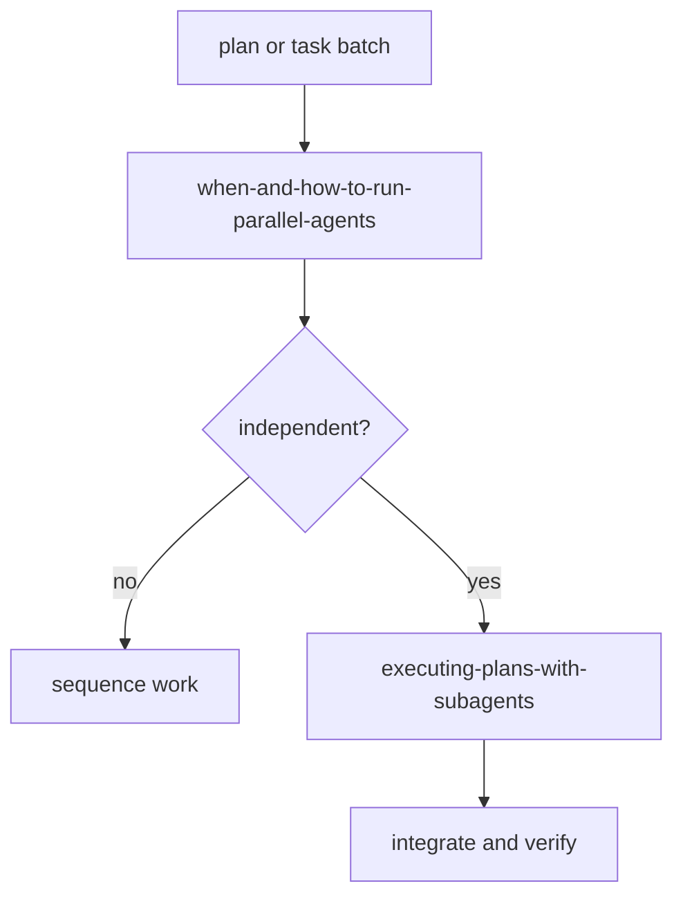

| Skill | Primary role | Tags |
| --- | --- | --- |
| `when-and-how-to-run-parallel-agents` | Decide whether work can be parallelized safely | orchestration, subagents, planning |
| `executing-plans-with-subagents` | Execute written plans through bounded subagent slices | orchestration, subagents, implementation |

### Reusable Workflow Helpers

Help steer other workflows and keep them focused. They can be used at any stage
when a specific risk or uncertainty appears.

| Skill | Primary role | Tags |
| --- | --- | --- |
| `prototype-first` | Validate risky assumptions before full implementation | planning, implementation, risk-reduction |
| `doubt-early` | Challenge uncertain plans or decisions with fresh context | planning, review, risk-reduction |

### Testing

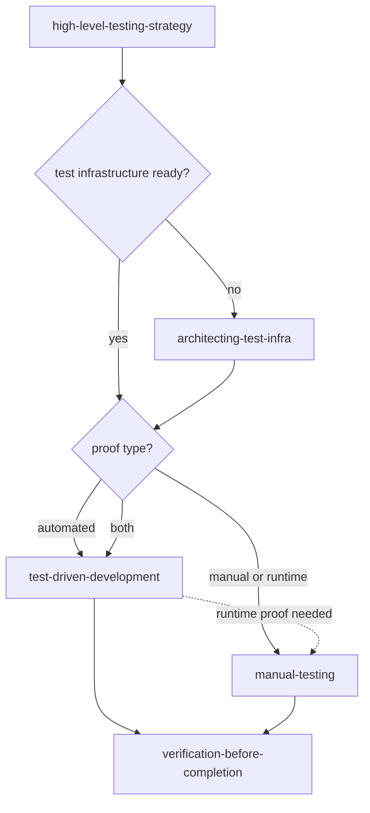

| Skill | Primary role | Tags |
| --- | --- | --- |
| `high-level-testing-strategy` | Decide what behavior needs proof | testing, planning, verification |
| `architecting-test-infra` | Design scalable test fixtures and environments | testing, architecture, verification |
| `test-driven-development` | Implement selected automated behavior tests test-first | testing, implementation, verification |
| `manual-testing` | Verify real runtime behavior through browser, API, CLI, or infra | testing, verification, operations |

### Debugging And Bug Prevention

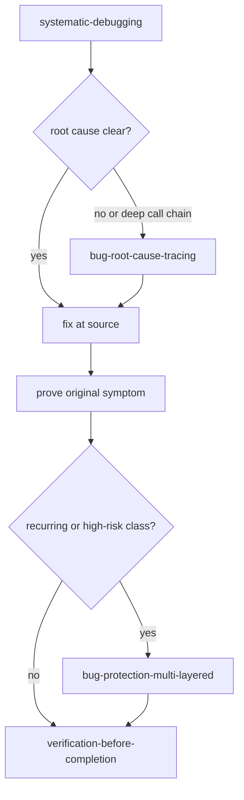

| Skill | Primary role | Tags |
| --- | --- | --- |
| `systematic-debugging` | Reproduce, localize, hypothesize, fix, and verify failures | debugging, root-cause, verification |
| `bug-root-cause-tracing` | Trace backward through call chains to the original trigger | debugging, root-cause |
| `bug-protection-multi-layered` | Add layered defenses against recurring bug classes | debugging, hardening, verification |

### Review And Feedback

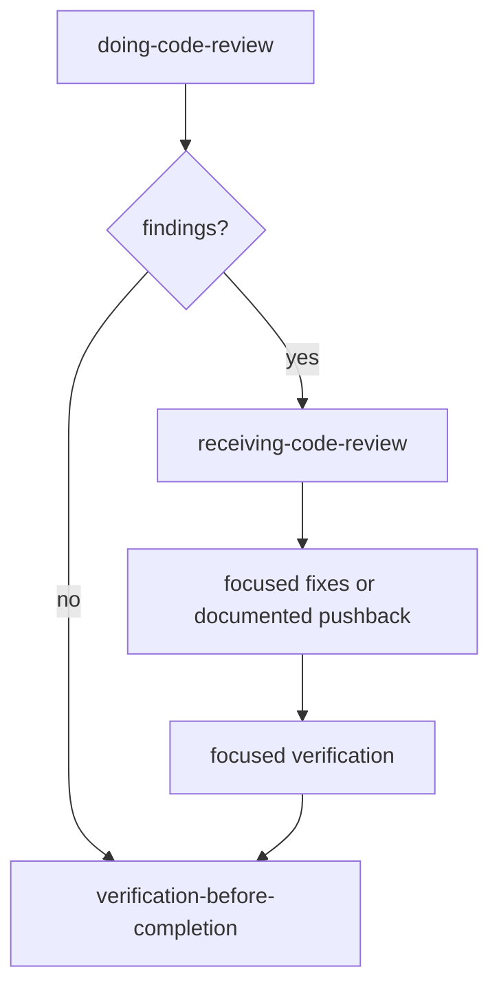

| Skill | Primary role | Tags |
| --- | --- | --- |
| `doing-code-review` | Review diffs, PRs, branches, and agent-written code | review, verification, quality |
| `receiving-code-review` | Classify and handle review feedback rigorously | review, implementation, quality |

### Domain-Specific Skills

Use these during larger workflows when the task crosses a domain boundary.

| Skill | Primary role | Tags |
| --- | --- | --- |
| `api-design` | Design stable APIs, protocols, and programmable boundaries | domain, architecture, boundaries |
| `security-and-hardening` | Harden user input, auth, secrets, files, sessions, and integrations | domain, hardening, boundaries |
| `performance-optimization` | Measure, identify, fix, and verify performance bottlenecks | domain, verification, quality |
| `code-simplification` | Refactor for clarity without behavior changes | domain, implementation, quality |
| `ci-cd-and-automation` | Configure CI/CD, quality gates, and deployment automation | domain, automation, release, operations |
| `release-automation-small-repos` | Build small release/publishing automation repositories | domain, automation, release |
| `shipping-and-launch` | Prepare launches, rollouts, monitoring, and rollback | domain, release, operations |

### Other: Atomic / Task-specific

Small focused skills for specific tasks.

| Skill | Primary role | Tags |
| --- | --- | --- |
| `how-to-write-skills` | Create or refine portable, discoverable skills | documentation, quality |
| `upstream-source-research` | Research upstream source code, issues, releases, and history | research, upstream |
| `ai-edge-research` | Research current practitioner adoption and AI tooling signals | research |
| `writing-upstream-bug-reports` | Prepare evidence-backed upstream bug reports for maintainers | debugging, upstream, documentation |

## Workflow Recipes

These recipes are references. They do not automatically advance a session. The
human, team lead, or current orchestrator controls phase transitions.

Soft handoff arrows mean "consider this next if the work calls for it", not
"load this automatically".

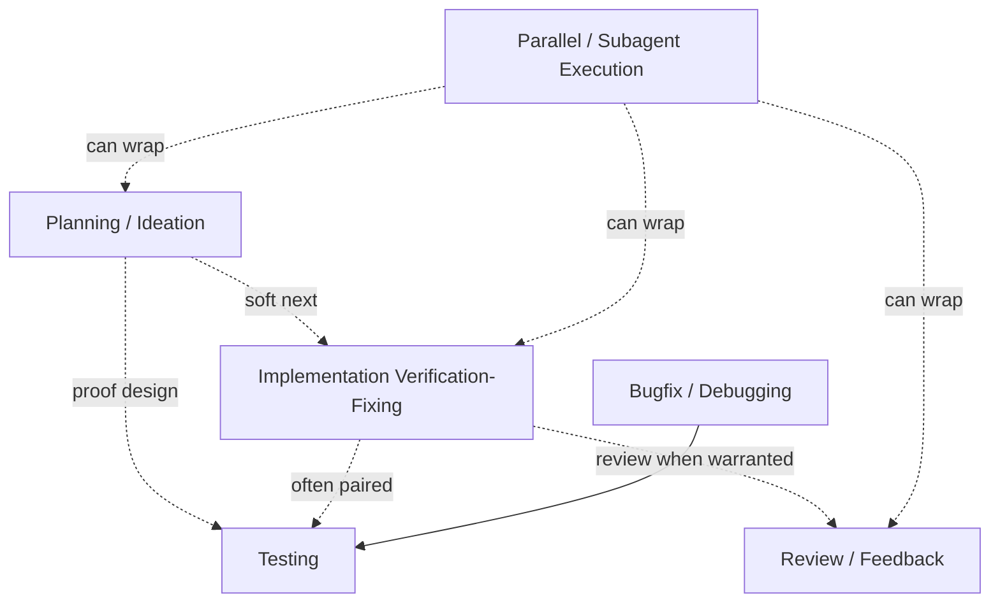

### Planning / Ideation

Use when the goal is vague, large, or needs design before implementation.

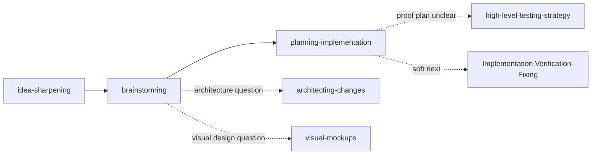

Exit when the concept, spec, tasks, acceptance criteria, risks, and verification
steps are clear enough for execution.

Planning commonly recommends the implementation loop as the next phase, but it
does not require that transition. Planning should also route to testing strategy
when the plan's proof or verification approach is non-trivial.

### Testing

Use when deciding how to prove behavior.

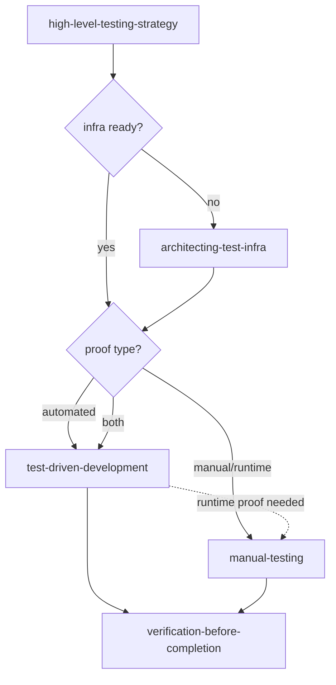

Exit when the selected automated or manual checks provide believable evidence for
the claim. Manual testing can be the primary proof when automation would be fake,
brittle, or not worth the cost.

Testing is often paired with implementation, debugging, or release work.

### Implementation Verification-Fixing

Use after a plan exists or a bounded implementation slice begins.

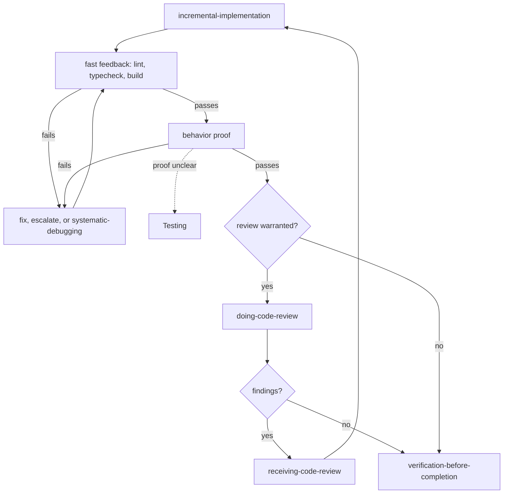

Exit when verification converges and remaining risks are explicit.

This workflow is a loop:

```text
implement -> verify -> fix
               ^        |
               ----------
```

It often pairs with Testing when behavior proof needs design.

### Bugfix / Debugging

Use for unexpected behavior, test failures, CI failures, flaky behavior, and
runtime bugs.

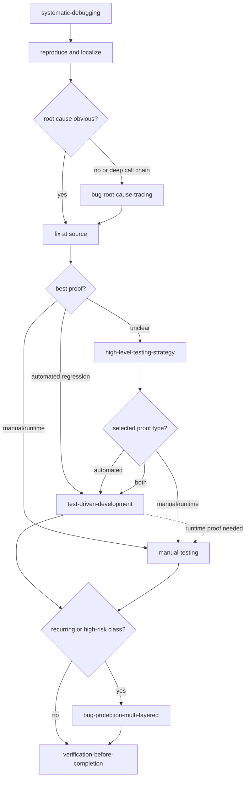

Exit when root cause is fixed, the original symptom is proven, and regression
risk is handled at the right level.

### Review / Feedback

Use for PRs, diffs, agent-written code, or review comments.

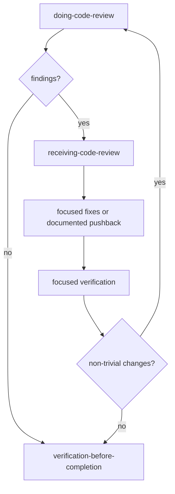

Exit when findings are fixed, rejected with evidence, or documented as accepted
trade-offs.

This workflow is often nested inside implementation, subagent integration, or PR
work.

### Parallel / Subagent Execution

Use when a plan contains independent work domains.

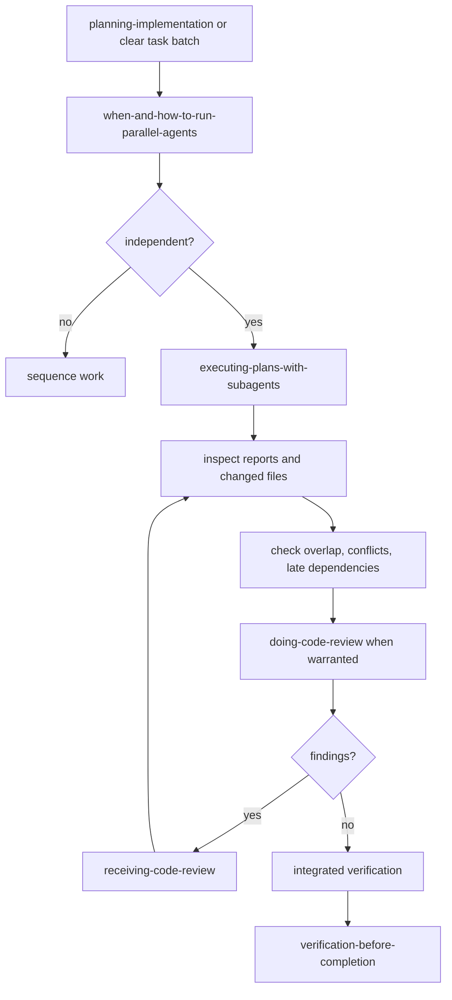

Exit when agent outputs are integrated, conflicts are reconciled, and integrated
verification passes.

This workflow can wrap other workflows during planning, implementation,
verification, review, or release work. It does not replace the orchestrator's
responsibility to inspect evidence.

## Compatibility Notes

Current assumptions:

- `skills/` is the canonical source.
- This README names canonical skills only.
- `.agents/skills` and `.claude/skills` are generated/symlinked mirrors.
- `upd-repo-symlinks.sh` expects immediate child directories under `skills/`.
- Nested category directories under `skills/` would currently be treated as skill
  directories by the mirror script.

Future restructuring requirements:

```text
If skills become nested later:
  update mirror generation to discover **/SKILL.md
  generate flat platform mirrors by skill name
  reject duplicate skill names
  prune stale symlinks
  verify target platforms follow symlinks and load expected skills
```

Until then, keep physical structure flat and express relationships through this
map, frontmatter, related-skill sections, and workflow maps inside skill files.
