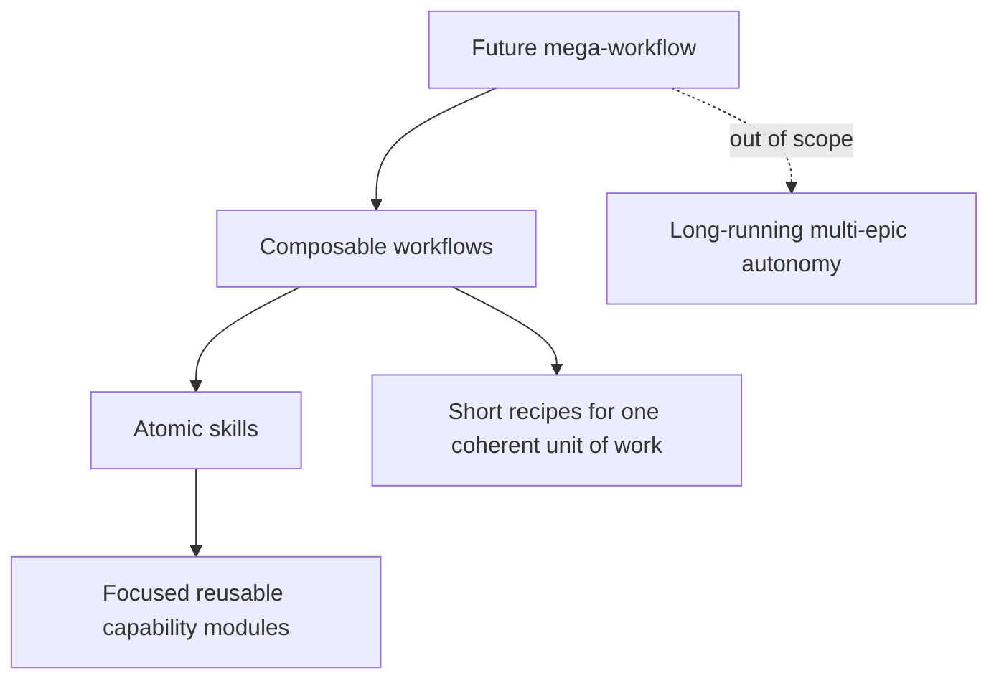
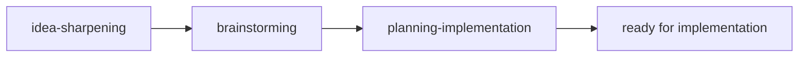
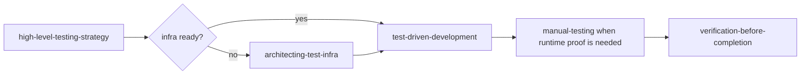
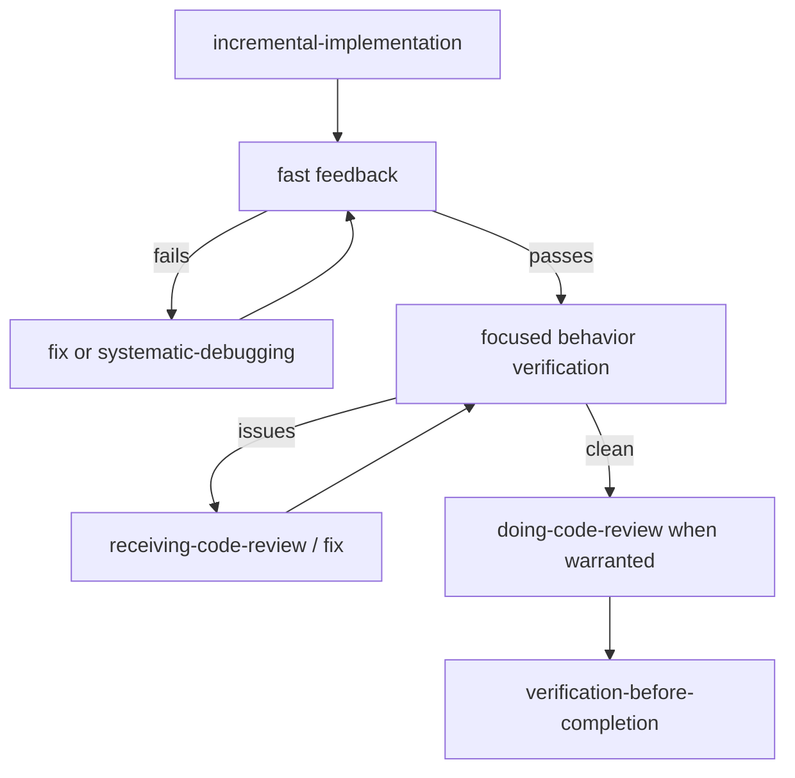
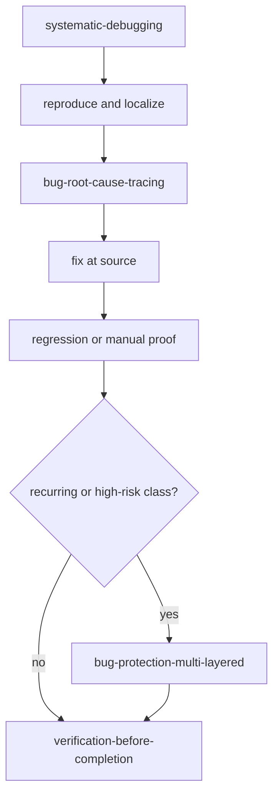
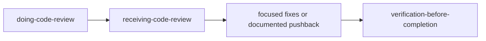
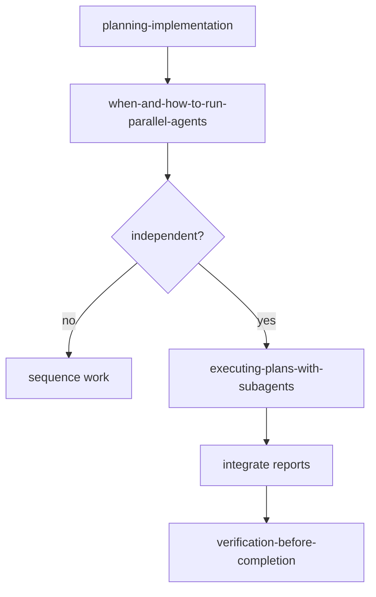

# Skill Map

This is the central map for the skill set in this repository.

Use this file to understand:

- how skills are organized conceptually
- which workflows compose multiple skills
- which skills fit feature, bugfix, greenfield, review, research, and release work
- how the flat `skills/` directory relates to generated platform mirrors

For the philosophy behind this map, see `../SKILLS-PHILOSOPHY.md`.

## Directory Model

`skills/` is intentionally flat and canonical.

```text
skills/
|-- api-design/
|   \-- SKILL.md
|-- systematic-debugging/
|   \-- SKILL.md
|-- verification-before-completion/
|   \-- SKILL.md
\-- ...
```

The category structure below is logical, not physical. Do not move skill folders
into nested category directories unless platform discovery and mirror generation
are redesigned first.

Generated mirrors:

```text
.agents/skills/<skill-name> -> ../../skills/<skill-name>
.claude/skills/<skill-name> -> ../../skills/<skill-name>
```

Refresh mirrors with:

```bash
./upd-repo-symlinks.sh
```

## Layer Model



| Layer | Role | Current status |
| --- | --- | --- |
| Atomic skills | Focused capabilities loaded for concrete needs | Implemented as `skills/*/SKILL.md` |
| Composable workflows | Short explicit recipes made from several skills | Documented here and inside some skills |
| Mega-workflow | Long-running multi-epic autonomous orchestration | Out of scope for now |

## Logical Catalog

### Planning And Design

```text
idea-sharpening -> brainstorming -> planning-implementation
                           |
                           v
                 architecting-changes
```

| Skill | Primary role | Tags |
| --- | --- | --- |
| `idea-sharpening` | Refine vague ideas into sharper concepts | planning, ideation |
| `brainstorming` | Turn understood features into technical specs | planning, design |
| `planning-implementation` | Break specs into ordered, verifiable tasks | planning, handoff |
| `architecting-changes` | Decide boundaries, ownership, and routing | architecture, router |
| `visual-mockups` | Explore UI layouts and diagrams visually with human | design, frontend |
| `documentation-and-adrs` | Preserve durable decisions and agent-facing context | docs, planning |

### Implementation Verification Fix

```text
clear task / plan
  -> incremental-implementation
  -> verification-before-completion
```

| Skill | Primary role | Tags |
| --- | --- | --- |
| `incremental-implementation` | Execute thin verified slices | implementation, discipline |
| `verification-before-completion` | Require evidence before success claims | verification, review |
| `git-workflow` | Manage branches, worktrees, staging, commits, and handoff | git, change-management |

### Testing

```text
high-level-testing-strategy
  -> architecting-test-infra
  -> test-driven-development / manual-testing
  -> verification-before-completion
```

| Skill | Primary role | Tags |
| --- | --- | --- |
| `high-level-testing-strategy` | Decide what behavior needs proof | testing, strategy |
| `architecting-test-infra` | Design scalable test fixtures and environments | testing, infrastructure |
| `test-driven-development` | Implement selected automated behavior tests test-first | testing, TDD |
| `manual-testing` | Verify real runtime behavior through browser, API, CLI, or infra | testing, runtime |

### Debugging And Bug Prevention

```text
systematic-debugging
  -> bug-root-cause-tracing
  -> fix at source
  -> bug-protection-multi-layered
  -> verification-before-completion
```

| Skill | Primary role | Tags |
| --- | --- | --- |
| `systematic-debugging` | Reproduce, localize, hypothesize, fix, and verify failures | debugging, root-cause |
| `bug-root-cause-tracing` | Trace backward through call chains to the original trigger | debugging, tracing |
| `bug-protection-multi-layered` | Add layered defenses against recurring bug classes | hardening, regression |

### Review And Feedback

```text
verification-before-completion
  -> doing-code-review
  -> receiving-code-review
  -> focused fixes
  -> restart
```

| Skill | Primary role | Tags |
| --- | --- | --- |
| `verification-before-completion` | Require evidence before success claims | review, verification |
| `doing-code-review` | Review diffs, PRs, branches, and agent-written code | review, quality |
| `receiving-code-review` | Classify and handle review feedback rigorously | review, feedback |

### Agent Orchestration

```text
plan or task batch
  -> when-and-how-to-run-parallel-agents
  -> executing-plans-with-subagents
```

| Skill | Primary role | Tags |
| --- | --- | --- |
| `when-and-how-to-run-parallel-agents` | Decide whether work can be parallelized safely | orchestrion |
| `executing-plans-with-subagents` | Execute written plans through bounded subagent slices | orchestrion |

### Domain specific skills

Used during other bigger tasks and in other workflows. Eg during planning or implementation/verification.

| Skill | Primary role | Tags |
| --- | --- | --- |
| `api-design` | Design stable APIs, protocols, and programmable boundaries | API, contracts |
| `security-and-hardening` | Harden user input, auth, secrets, files, sessions, and integrations | security, boundaries |
| `performance-optimization` | Measure, identify, fix, and verify performance bottlenecks | performance, profiling |
| `code-simplification` | Refactor for clarity without behavior changes | refactor, readability |
| `ci-cd-and-automation` | Configure CI/CD, quality gates, and deployment automation | CI, automation |
| `release-automation-small-repos` | Build small release/publishing automation repositories | release, packaging |
| `shipping-and-launch` | Prepare launches, rollouts, monitoring, and rollback | launch, operations |

`release-automation-small-repos` intentionally references `writing-python-scripts`.
That skill currently lives outside this repository and is planned to be ported
later.

### Reusable Workflow Helpers

Help to steer other workflows and keep them focused. Can be used at any stage, within existing workflow or whenever it might be helpful.

| `prototype-first` | Validate risky assumptions before full implementation | risk, spike |
| `doubt-early` | Challenge uncertain plans or decisions with fresh context | review, risk |

### Atomic / Task-specific

Small focused skills for specific tasks.

| Skill | Primary role | Tags |
| --- | --- | --- |
| `how-to-write-skills` | Create or refine portable, discoverable skills | skills, ai |
| `upstream-source-research` | Research latest clean info about upstream sources/libs/apps | research, sources |
| `ai-edge-research` | Research latest real-world feedback and practices about ai and tooling | ai, research |

## Workflow Recipes

These recipes are references. They do not automatically advance a session. The
human, team lead, or current orchestrator controls phase transitions.

### Planning / Ideation

Use when the goal is vague, large, or needs design before implementation.



Exit when the concept, spec, tasks, acceptance criteria, risks, and verification
steps are clear enough for execution.

Planning workflow proposes to proceed to implementation workflow once all plans are done. But this is a recommendation, not a required next step.

Since a plan should also cover tests, this workflow recommends to use planning-related skills from testing workflow.

### Testing Proof

Use when deciding how to prove behavior.



Exit when the selected automated or manual checks provide believable evidence for
the claim.

Usually used in pair with implementation workflow.

### Implementation Verification-Fixing

Use after a plan exists or a bounded implementation slice begins.



Exit when verification converges and remaining risks are explicit.

This workflow is a loop:

```text
implement -> verify -> fix
               ↑        |
               ----------
```

Recommends to be paired with testing workflow.

### Bugfix / Debugging

Use for unexpected behavior, test failures, CI failures, flaky behavior, and
runtime bugs.



Exit when root cause is fixed, original symptom is proven, and regression risk is
handled at the right level.

### Review / Feedback

Use for PRs, diffs, agent-written code, or review comments.



Exit when findings are fixed, rejected with evidence, or documented as accepted
trade-offs.

Usually this workflow is a nested part of implementation workflow.

### Parallel / Subagent Execution

Use when a plan contains independent work domains.



Exit when agent outputs are integrated, conflicts are reconciled, and integrated
verification passes.

This workflow can be used with any other workflow, on all stages: during planning, implementation, verification and so on.

## Compatibility Notes

Current assumptions:

- `skills/` is the canonical source.
- `.agents/skills` and `.claude/skills` are generated/symlinked mirrors.
- `upd-repo-symlinks.sh` expects immediate child directories under `skills/`.
- Nested category directories under `skills/` would currently be treated as skill
  directories by the mirror script.

Future restructuring requirements:

```text
If skills become nested later:
  update mirror generation to discover **/SKILL.md
  generate flat platform mirrors by skill name
  reject duplicate skill names
  prune stale symlinks
  verify target platforms follow symlinks and load expected skills
```

Until then, keep physical structure flat and express relationships through this
map, frontmatter, related-skill sections, and workflow recipes.
