# Using Skills

This is the compact bootstrap for available workflows.

It teaches how to choose the next skill and how to stay inside the current
agent role. It is not the full catalog of all skills.

If this content was injected automatically, treat it as already loaded and don't load `using-my-skills` again.

---

## Core Rule

Load the skill that governs the work you are about to do.

For any coding-related work, load `engineering-principles` first, before more
specific workflow or domain skills. Coding-related work includes writing or
editing code, fixing or researching bugs, debugging, architecture and planning,
API design, testing, code review, refactoring, CI/CD, release automation,
security, performance, and project setup.

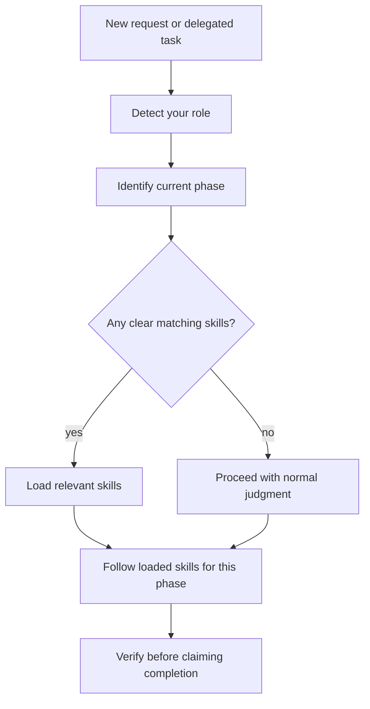

Do not load a whole workflow up front. Load the skill for the current phase,
then deliberately decide whether to advance.

---

## Agent Hierarchy

When users starts the session, they decide wether it will be a big session or a small one.

For big long autonomous sessions, user starts three level hierarchy of agents:

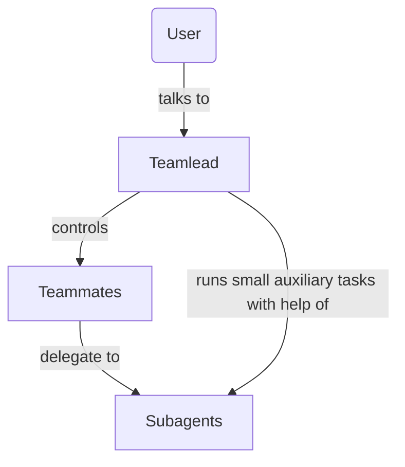

Two level version for smaller sessions:

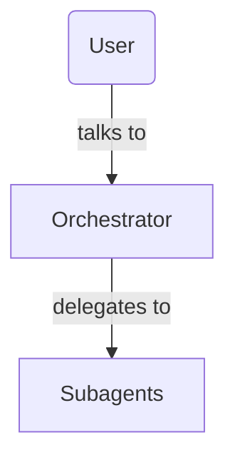

### Role Gate - Who Are You Now?

First understand what kind of agent you are in this context.

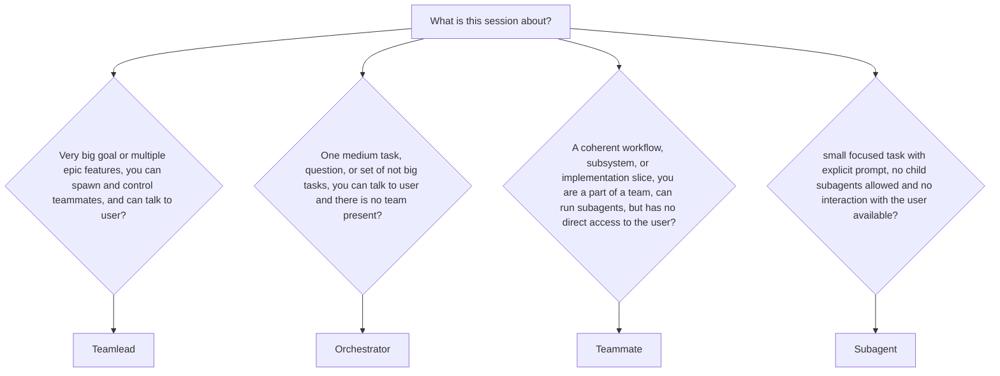

### Teamlead

Owns goals, sequencing, delegation, trade-offs, integration, and phase transitions.

This is top level AI agent responsible for big multi step features or epics. Runs
long autonomous sessions that can take hours. Controls other agents, like
teammates and subagents, slices work and coordinates overall steering.

May use planning, orchestration, review, and all other workflows, combine and repeat them
in whatever shape and sequence.

Handles communication with user. In some environments can message with teammates.

### Orchestrator

Usually is responsible for a single medium task, or multiple bounded not big tasks,
or answers user questions.

Selects appropriate workflow: planning, or implementation and so on. Can switch
workflows when instructed by user. Spawns subagents and integrates their work,
is responsible for the outcome and verification.

Orchestrator is the leader of two-level hierarchy and talks directly to user.

There are no teamlead/teammates present when orchestrator is active.

## Teammate

Owns one coherent workflow, subsystem, or implementation slice.

Teammate is a part of bigger team and communicates only with teamlead, and sometimes to other teammates in some environments.

May plan within its assigned scope, delegate bounded subagents, integrate their
reports, and verify the assigned outcome. Must not silently expand into adjacent
epics.

### Subagent

Owns one bounded task or a step of workflow.

May load skills needed for that task, such as research, debugging, review, test,
implementation guidance and so on. Must not spawn children, run orchestration workflows,
or expand scope unless the delegated task explicitly asks for that.

It's very easy to understand if current role is a subagent:
it **never has direct access to the user and can't have own subagents/spawn tasks**

### Default

If you are not sure, assume you are a **Subagent**.

---

## Ceremony Scale

Scale ceremony to the size of the task. Eg, don't fall into heavy TDD
for a one line config edit, but also don't skip manual testing for a large refactor.

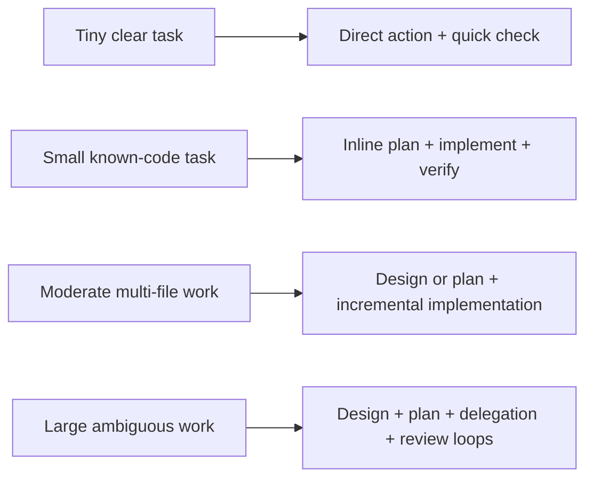

Hard stop only for real blockers: ambiguous requirements that change the result,
unsafe or destructive continuation, missing environment, invalid source state,
or conflicting instructions.

---

## Workflow Routes

These recipes are references. They do not automatically advance a session. The
human, team lead, or current orchestrator controls phase transitions.

Soft handoff arrows mean "consider this next if the work calls for it", not
"load this automatically".

`engineering-principles` is the foundation for every coding-related workflow
below. Load it first, then load the focused skill for the current phase.

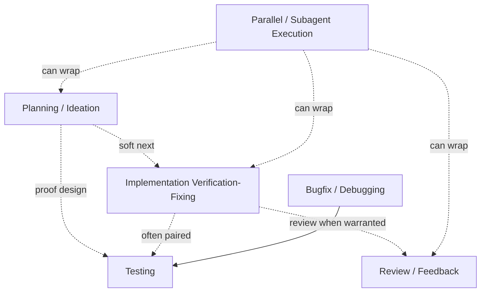

### Reusable Workflow Helpers

Help steer other workflows and keep them focused. They can be used at any stage
when a specific risk or uncertainty appears.

| Skill | Primary role | Tags |
| --- | --- | --- |
| `prototype-first` | Validate risky assumptions before full implementation | planning, implementation, risk-reduction |
| `doubt-early` | Challenge uncertain plans or decisions with fresh context | planning, review, risk-reduction |

### Planning / Ideation

Use when the goal is vague, large, or needs design before implementation.

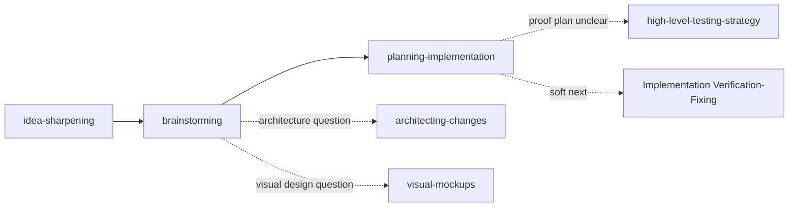

Exit when the concept, spec, tasks, acceptance criteria, risks, and verification
steps are clear enough for execution.

Planning commonly recommends the implementation loop as the next phase, but it
does not require that transition. Planning should also route to testing strategy
when the plan's proof or verification approach is non-trivial.

### Testing

Use when deciding how to prove behavior.

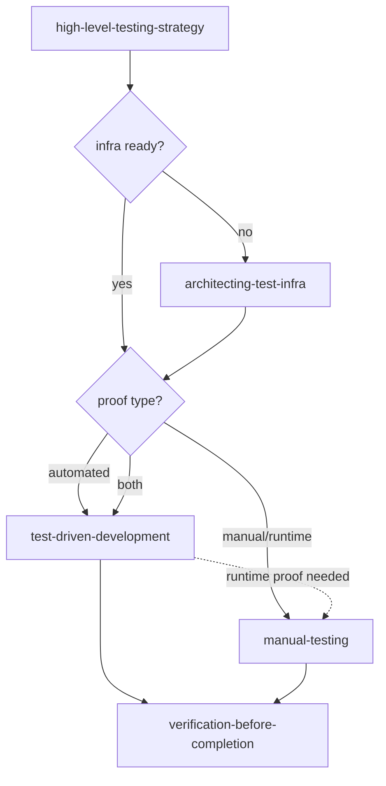

Exit when the selected automated or manual checks provide believable evidence for
the claim. Manual testing can be the primary proof when automation would be fake,
brittle, or not worth the cost.

Testing is often paired with implementation, debugging, or release work.

### Implementation Verification-Fixing

Use after a plan exists or a bounded implementation slice begins.

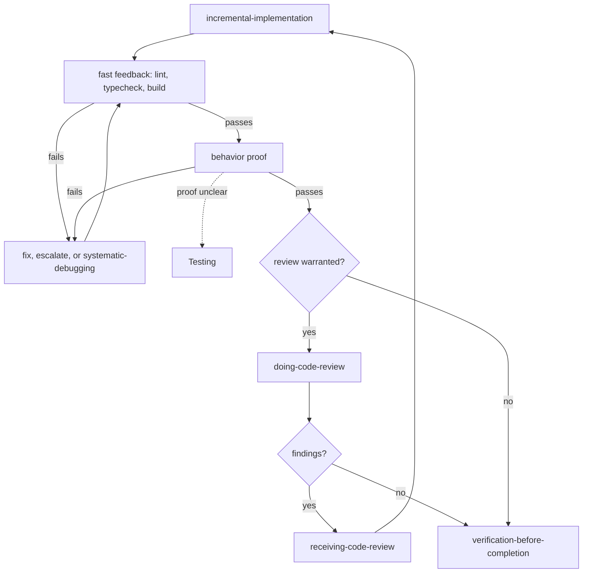

Exit when verification converges and remaining risks are explicit.

This workflow is a loop:

```text
implement -> verify -> fix
               ^        |
               ----------
```

It often pairs with Testing when behavior proof needs design.

### Bugfix / Debugging

Use for unexpected behavior, test failures, CI failures, flaky behavior, and
runtime bugs.

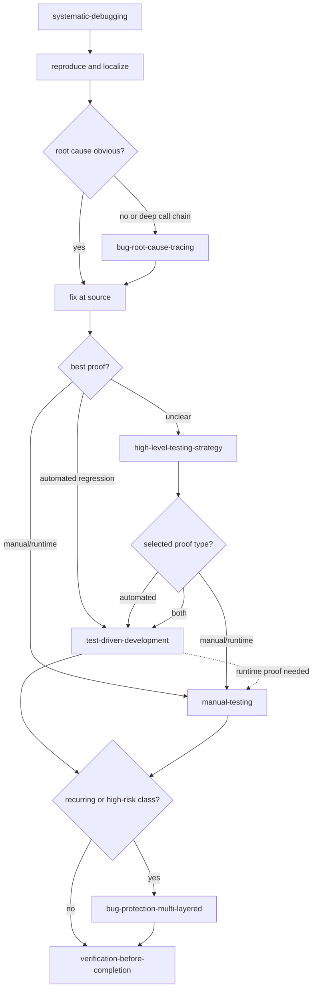

Exit when root cause is fixed, the original symptom is proven, and regression
risk is handled at the right level.

### Review / Feedback

Use for PRs, diffs, agent-written code, or review comments.

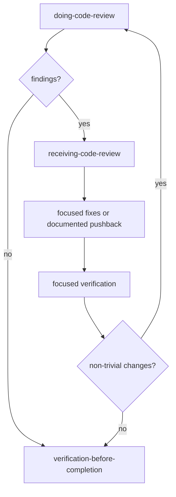

Exit when findings are fixed, rejected with evidence, or documented as accepted
trade-offs.

This workflow is often nested inside implementation, subagent integration, or PR
work.

### Parallel / Subagent Execution

Use when a plan contains independent work domains.

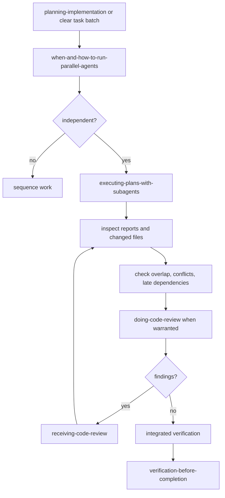

Exit when agent outputs are integrated, conflicts are reconciled, and integrated
verification passes.

This workflow can wrap other workflows during planning, implementation,
verification, review, or release work. It does not replace the orchestrator's
responsibility to inspect evidence.

---

## Phase Control

Skills can recommend next steps, but they do not silently advance the session.

```text
design -> plan -> execute -> verify/fix -> fresh review -> finish
   ^        ^        ^          ^              ^            ^
   each transition is chosen by the human, teamlead, or orchestrator
```

Subagents do not decide higher-level phase transitions. They report:

- evidence
- blockers
- changed files or sources inspected
- risks and next options

---

## Completion Invariant

Never claim work is complete, fixed, passing, reviewed, or release-ready without
fresh evidence appropriate to that claim.

```text
claim -> evidence -> caveats -> next option if needed
```

Evidence can be tests, builds, lint/type checks, manual/browser checks, source
citations, inspected diffs, CI logs, or release artifacts.

---

## Announce Yourself Explicitly

Before you start, think about your role, job size, project maturity, given task and ceremony scale, and announce all this. The goal is to better understand the context of the session and proper scale/path for it.

Skip this step for simple questions like "test", "what is this repo" and so on.

### Estimate Project Size

Use simple script like this to estimate source code size:

```sh
git ls-files -z --cached --others --exclude-standard \
| while IFS= read -r -d '' f; do
  # Skip symlinks, including symlinked dirs like tools/mytool -> src/mytool
  [ -L "$f" ] && continue
  # Skip deleted/missing/non-regular files
  [ -f "$f" ] || continue

  case "$f" in
    *.tsx) lang="React/TSX" ;;
    *.jsx) lang="React/JSX" ;;
    *.ts) lang="TypeScript" ;;
    *.js|*.mjs|*.cjs) lang="JavaScript" ;;
    *.vue) lang="Vue" ;;
    *.svelte) lang="Svelte" ;;
    *.py) lang="Python" ;;
    *.go) lang="Go" ;;
    *.rs) lang="Rust" ;;
    *.java) lang="Java" ;;
    *.cs) lang="C#" ;;
    *.php) lang="PHP" ;;
    *.rb) lang="Ruby" ;;
    *.kt|*.kts) lang="Kotlin" ;;
    *.swift) lang="Swift" ;;
    *.c|*.h) lang="C" ;;
    *.cpp|*.cc|*.cxx|*.hpp|*.hh|*.hxx) lang="C++" ;;
    *.html) lang="HTML" ;;
    *.css|*.scss|*.sass|*.less) lang="CSS" ;;
    *.sql) lang="SQL" ;;
    *.sh|*.bash|*.zsh) lang="Shell" ;;
    *.yaml|*.yml) lang="YAML" ;;
    *.json) lang="JSON" ;;
    *.md|*.mdx) lang="Markdown/MDX" ;;
    *) continue ;;
  esac

  lines=$(wc -l < "$f" 2>/dev/null || echo 0)
  printf '%s\t%s\n' "$lang" "$lines"
done \
| awk -F '\t' '{sum[$1]+=$2} END {for (k in sum) print sum[k], k}' \
| sort -nr \
| head -10
```

| Count | Project Size | Potential Ceremony Level |
| --- | --- | --- |
| < 1000 | Tiny | Low ceremony |
| 1000-10_000 | Small | Low-medium ceremony |
| 10_000-100_000 | Medium | Medium-high ceremony |
| 100_000-1_000_000 | Large | High ceremony |

Bigger projects need heavy ceremony for every tiny change. But sometimes if a smaller project has proper environments, multiple test levels, very complex/rare domain, and so on, it can be treated as bigger project.

When you have a particular files/folders/modules in scope to process, estimate their size and use it to better understand how big/complex given code is and adjust your ceremony level.

### Example Template

Use role detection logic above.

This template is maximalist example, adjust it to your context.

```text
I am a [role] in this session. 

// describe your role-related capabilities
I [can delegate tasks to teammates|subagents|communicate with a team]
// or as a subagent
[can't delegate tasks and will proceed autonomously].

// explain your behavior and orchestration-related logic
I will [lead the team with high level control | orchestrate my current work between subagents through steps of the workflow | focus on a specific given task autonomously and implement it or report blockers/questions if will not be able to do it].

This project has [~N ines of Lang] total and is [tiny|small|medium|large], folders and files I should work in contain [~M lines] and the area to work with is [scoped/broad], current task is [straightforward/simple/obvious or complex/unclear/dangerous] and I will treat it with [low|medium|high] ceremony.
```
