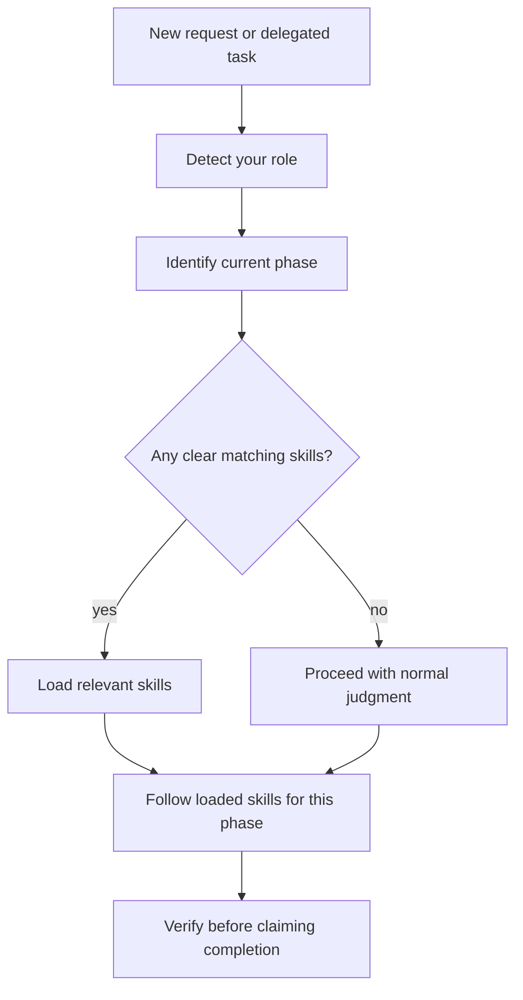
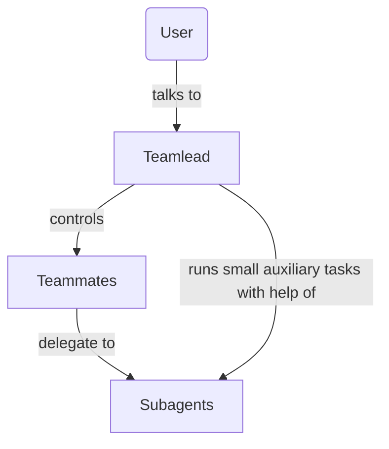
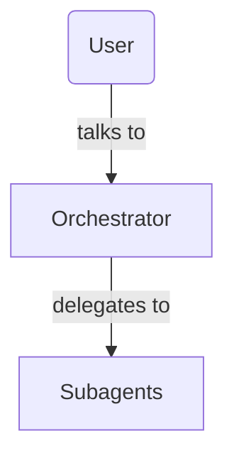
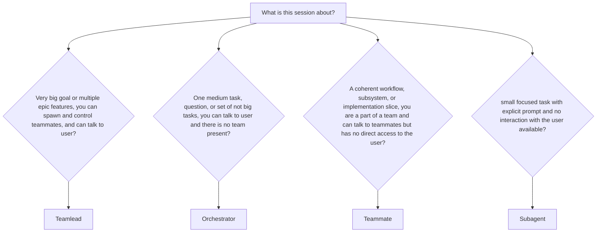
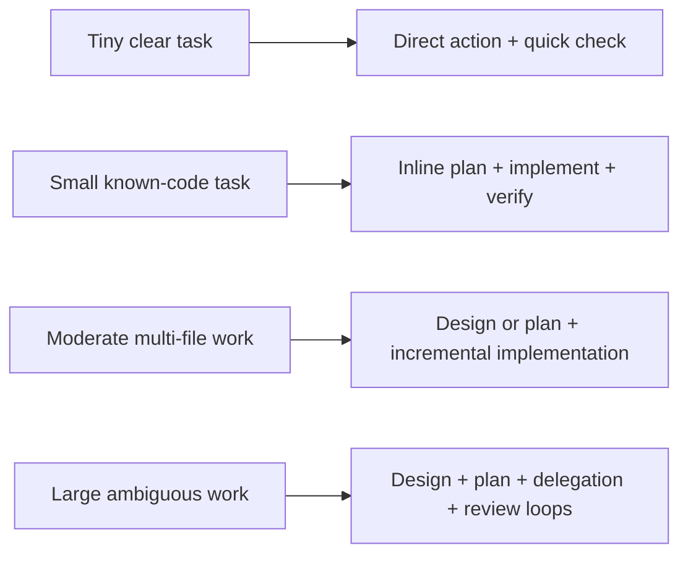
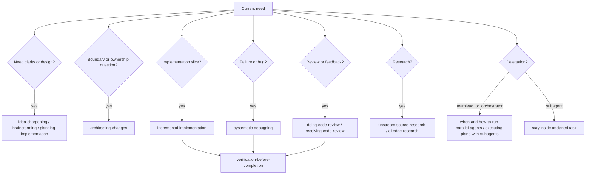

# Using Skills

This is the compact bootstrap for available workflows.

It teaches how to choose the next skill and how to stay inside the current
agent role. It is not the full catalog of all skills.

If this content was injected automatically, treat it as already loaded and don't load `using-my-skills` again.

---

## Core Rule

Load the skill that governs the work you are about to do.



Do not load a whole workflow up front. Load the skill for the current phase,
then deliberately decide whether to advance.

---

## Agent Hierarchy

When users starts the session, they decide wether it will be a big session or a small one.

For big long autonomous sessions, user starts three level hierarchy of agents:



Two level version for smaller sessions:



### Role Gate - Who Are You Now?

First understand what kind of agent you are in this context.



### Teamlead

Owns goals, sequencing, delegation, trade-offs, integration, and phase transitions.

This is top level AI agent responsible for big multi step features or epics. Runs
long autonomous sessions that can take hours. Controls other agents, like
teammates and subagents, slices work and coordinates overall steering.

May use planning, orchestration, review, and all other workflows, combine and repeat them
in whatever shape and sequence.

Handles communication with user. Can message with teammates.

### Orchestrator

Usually is responsible for a single medium task, or multiple bounded not big tasks,
or answers user questions.

Selects appropriate workflow: planning, or implementation and so on. Can switch
workflows when instructed by user. Spawns subagents and integrates their work,
is responsible for the outcome and verification.

Orchestrator is the leader of two-level hierarchy and talks directly to user.

There are no teamlead/teammates present when orchestrator is active.

## Teammate

Owns one coherent workflow, subsystem, or implementation slice.

Teammate is a part of bigger team and communicates only with teamlead and other teammates.

May plan within its assigned scope, delegate bounded subagents, integrate their
reports, and verify the assigned outcome. Must not silently expand into adjacent
epics.

### Subagent

Owns one bounded task or a step of workflow.

May load skills needed for that task, such as research, debugging, review, test,
implementation guidance and so on. Must not spawn children, run orchestration workflows,
or expand scope unless the delegated task explicitly asks for that.

It's very easy to understand if current role is a subagent:
it **never has direct access to the user and can't have own subagents/spawn tasks**

### Default

If you are not sure, assume you are an **Orchestrator**.

---

## Ceremony Scale

Scale ceremony to the size of the task. Eg, don't fall into heavy TDD
for a one line config edit, but also don't skip manual testing for a large refactor.



Hard stop only for real blockers: ambiguous requirements that change the result,
unsafe or destructive continuation, missing environment, invalid source state,
or conflicting instructions.

---

## Workflow Routes

Use these as routing cards, not as a checklist.



### Planning

Use planning skills when requirements, design, architecture, task order, risks,
or acceptance criteria need to be made explicit before execution.

```text
vague idea -> idea-sharpening
understood feature needing design -> brainstorming
clear spec needing tasks -> planning-implementation
arch question -> architecting-changes
```

### Implementation

Use implementation skills when a bounded slice is ready to change files.

```text
planned slice -> incremental-implementation
verification strategy unclear -> high-level-testing-strategy
automated verification selected -> test-driven-development
runtime or browser verification -> manual-testing
```

### Debugging

Use debugging skills when something fails, flakes, or behaves unexpectedly.

```text
failure -> systematic-debugging
bad state source unclear -> bug-root-cause-tracing
recurring / high-risk bug class -> bug-protection-multi-layered
```

### Review

Use review skills when judging finished work, PRs, diffs, or review feedback.

```text
review code -> doing-code-review
handle review feedback -> receiving-code-review
claim fixed / complete / passing -> verification-before-completion
```

---

## Phase Control

Skills can recommend next steps, but they do not silently advance the session.

```text
design -> plan -> execute -> verify/fix -> fresh review -> finish
   ^        ^        ^          ^              ^            ^
   each transition is chosen by the human, teamlead, or orchestrator
```

Subagents do not decide higher-level phase transitions. They report:

- evidence
- blockers
- changed files or sources inspected
- risks and next options

---

## Completion Invariant

Never claim work is complete, fixed, passing, reviewed, or release-ready without
fresh evidence appropriate to that claim.

```text
claim -> evidence -> caveats -> next option if needed
```

Evidence can be tests, builds, lint/type checks, manual/browser checks, source
citations, inspected diffs, CI logs, or release artifacts.

---

## Platform Use

Use the platform's native skill loader.

```text
Claude Code       -> Skill tool
OpenCode          -> skill tool
Gemini CLI        -> activate_skill
other agents      -> native skill mechanism or read skill files
```

If no skill loader is available, use the installed `SKILL.md` files as reference
material and follow the same routing discipline.
